# INDEX

| SEEKERS                 | 3  | EVACUATION            | 37 |
|-------------------------|----|-----------------------|----|
| ITS: BASIC RULES        | 4  | HARDLOCK              | 40 |
| TOURNAMENT RULES        | 7  | LAST LAUNCH           | 42 |
| INFINITY TABLES         | 10 | PROVISIONING          | 45 |
| SEASON 17               | 12 | ZONE OF INTEREST      | 48 |
| EXTRAS                  | 16 | ITS DIRECT ACTION     | 51 |
| CLASSIFIED OBJECTIVES   | 17 | ANNIHILATION          | 51 |
| ITS RANKING             | 19 | BATTLEGROUND          | 53 |
| ITS SCENARIOS           | 20 | CUTTHROAT             | 55 |
| AKIAL INTERFERENCE      | 21 | SUPERIORITY           | 57 |
| B-PONG                  | 24 | UPLINK CENTER         | 60 |
| CORPORATE APPROPRIATION | 27 | RESILIENCE OPERATIONS | 63 |
| CRITICAL INTERVENTION   | 30 | GLOSSARY              | 66 |
|                         |    |                       |    |

[CROSSING LINES](#page-33-0) 34

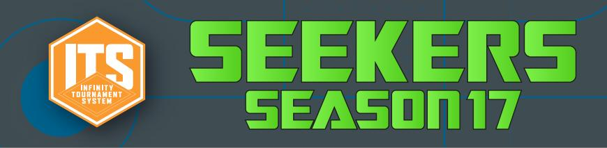

# SEEKERS

It began as a rumor on Shinju's datasphere: a message forwarded from comlog to comlog, a restricted-access story in someone's halo. Some guys at the University of Manaheim had just developed a system to predict the emergence of QAZs. It was an unverified and unfiltered announcement that upended the Sāchā community, Shinju's xenotechnology seekers. Some of them claimed it would mark the end of their trade and their life's calling. Other people anticipated the advent of a golden age. And many grieved that the art in their business would be lost.

According to those rumors, this technology had already been seized by PanOceania and the Greater Independent Japan as a result of an operation conducted against a research outpost in the Barrenlands of the Ryakudatsu. And the rest of the big powers were just biding their time to determine if it really worked before kicking off their own research. So, in the meantime, spy remotes fly across the wastelands looking for any expeditions that may have furtively ventured out in search of a QAZ in an attempt to ascertain if any have been successful, and then send a raiding team to intercept these expeditions on their return journey and capture any artifacts they may have found.

Thus, many front companies—subsidiaries of corporations that work closely with intelligence services, either out of mutual interest or because they are being coerced into doing so in order to prevent some dirty secrets from coming to light—send their expeditions into the Barrenlands under the pretense of carrying out research. In actuality, these teams are made up of elite operatives devoid of patches, or any ID, and their sole mission is to get their hands on disruptive xenotechnology by any means necessary, regardless of international law, and no matter the cost.

Never did the Barrenlands see so much activity and never had the servers of Bureau Aegis' surveillance systems on Shinju faced this many overwhelming cyberattacks aimed at masking their illegal incursions into the Ryakudatsu. At present, all powers are acting as seekers. Some use cutting-edge tech as their competitive advantage, while others stalk their prey and descend on them like raptors. But these prey have sharp claws and fangs too, and they are ready to fight back to protect the items they have worked so hard to obtain.

Tensions are sure to escalate, and a secret conflict will be fought far from the sight of the rest of the Sphere, one that could tip the balance of power if any player were to find a strategic xenoartifact. And that requires more than just QAZ-locating technology. It requires people who know how to get in and out of those hellish environments, and how to survive all the dangers they hold within. It requires having a Sāchā, a crucial asset for all powers acting as seekers. So, these times offer plenty of opportunities for these adventurers, a chance to amass riches and glory, or a chance to die the most gruesome death imaginable, because the QAZs offer no middle ground.

# ITS: BASIC RULES

Infinity Tournament System (ITS) is Infinity's official system for organized play and features an International Ranking to keep track of each player's score. There are a number of ways to participate in ITS, but all ITS events share the basic rules set forth in this document.

For an event to be officially sanctioned and its results recorded onto the International Ranking, it must comply with all applicable rules. The ITS rules are divided into those pertaining to the participants and those pertaining to the tournament organizers. The purpose of these rules is to facilitate the organization of and participation in Infinity tournaments in a way that allows all members of the player community to be a part of a worldwide system with

common ground rules that are fair to all.

## EVENT PARTICIPANTS

In order to take part in an official ITS event, players are required to bring everything they need to play, including:

- ^ Miniatures.
- ^ Tape measure.
- ^ Templates and markers.
- ^ Dice.
- ^ Operations Deck.
- ^ Army lists.

Participation in official Infinity events implies knowledge and acceptance of all rules in this document as well as any rules set forth by the event Organizer.

## SPORTSMANSHIP

All participants in an event, whether Organizers, Players, or guests, are expected to conduct themselves in a friendly and considerate manner at all times. If a participant disrupts the good atmosphere of an event, the Organizer may penalize them or altogether remove them from play.

Minimum player etiquette includes giving the opponent time to clearly see the results on your dice before picking them up, sharing with the opponent all open information from your army list and clarifying it as often as requested, waiting for the opponent to declare ARO whenever you spend an Order, etc

#### REMEMBER

Infinity is first and foremost a game and events should be fun for everyone involved.

#### MINIATURES

All miniatures used by the players must be from Corvus Belli's official Infinity range and must be assembled—with at least their main components—and based, using the base supplied with the figure or another of the same size.

Each figure must represent faithfully the Trooper it stands for, including its equipment and weapon options. If a player does not have the official miniature, then at the tournament organizer's discretion, they can use a different Corvus Belli miniature as a stand-in, but they must clearly inform their opponent of what that figure represents.

#### LINE OF FIRE (LOF)

For the sake of clarity and agility, every figure in play must display its 180º Line of Fire arc by means of distinct painted markings on its base or the appropriate markers (such as Corvus Belli's new bases, Customeeple's Line of Sight Markers or Micro Art Studio's Infinity Arc Markers).

#### PAINTING

Unless otherwise specified by the rules of the event, figures do not need to be painted. But it is recommended to enjoy the experience of hobby to the maximum.

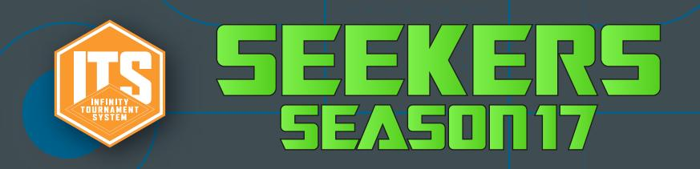

#### PROXIES

Under no circumstances can miniatures from other brands or manufacturers be used as proxies. The use of other Corvus Belli miniatures is allowed; however, players must inform their adversary which Trooper is being represented. The figure must use the same size base as the Trooper being represented.

#### CONVERTED FIGURES

Use of converted figures is allowed, and in fact encouraged, as long as most or all the figure is composed of parts from Corvus Belli miniatures and the figure accurately represents the unit and weapon option it stands for. The figure must use the same size base as the Trooper being represented.

#### ARMY LISTS

Army Lists must conform to the rules laid out in the Infinity rulebooks and the special rules of the event, if there are any.

All participating Players must use the Infinity Army web app or mobile app (available for free on the Infinity website) to create and check their Army Lists. Should there be a discrepancy, the information available on the official Infinity website takes precedence.

#### MERCENARIES

Mercenary Troops, such as the Yuan Yuan or Avicenna, can be fielded only as part of the Generic or Sectorial Armies in which they are available.

#### RULES

The Official Game Rules and Official Army Lists are those published by Corvus Belli on the official Infinity website (www. infinitytheuniverse.com/) and on the official Infinity Army builder (www. infinitytheuniverse.com/army).

**All game rules, FAQs, Infinity Wiki, Rules Errata, and army lists published up to one week before the date of an event apply to that event.**

## EVENT ORGANIZERS

The Event Organizer is the person, store, or club that will organize and manage the event.

Organizers are expected to be an example of good conduct, whether they are participating in the event as players or not.

#### DUTIES OF THE ORGANIZER

The Organizer is responsible for:

- ^ Ensuring that the rules of the event and the game rules are observed.
- ^ Informing Corvus Belli of the results of the event, as indicated in the rules for that type of event.
- ^ Ensuring all participants are registered in the ITS before the event takes place. Players can register using the form available at: https://sphere.corvusbelli.com/
- ^ Providing an adequate venue for the event, as well as anything else required to play (tables, scenery, etc.).
- ^ Establishing the times and duration of each game.

## REFEREES

During events, Referees are the ultimate authority in matters of game rules, which is why they are expected to make fair rulings and to devote all the time necessary to solving the players' doubts. To make the Referee's job easier, players are encouraged to try to solve their disputes in a friendly manner, and only turn to the Referee if an agreement cannot be reached. Once requested, the Referee's rulings are final.

In the same way, the Referee can establish the sanction he considers appropriate if a player doesn't follow the rules determined by the Organizer.

The Referee and the Organizer of the event will often be the same person. If they are not, the Organizer is bound by the rulings of the Referee like any other participant, both in matters of game rules and conflict resolution.

To prevent conflicts of interest, it is advisable—but not mandatory—for the Referee to abstain from participating in the event as a player.

## RANKINGS

Every Official ITS event counts towards Infinity Player Rankings.

Rankings rate players according to their performance in officially sanctioned events, as indicated by their ITS Rating.

Players start the season with an ITS Rating of 1000. Their performance in each Official ITS event they take part in modifies that Rating, depending on whether the result was better or worse than expected as predicted by an Elo rating system.

The amount by which the ITS Rating of a player varies with each event depends on the event's K factor, as follows:

| TOURNAMENT TYPE      | 400/350-TIER | 300/250-TIER | 200/150-TIER |
|-------------------------|--------------|--------------|--------------|
| Tournament or league | K+15%        | K=32         | K-15%        |

Special events, such as the Interplanetario Tournament, might have different K factors

At the end of the season, the winner of the Ranking will receive the following prizes:

^ Unlocking the Quantronic Crown achievement in the player's profile.

#### REGIONAL RANKINGS

There are a total of three separate Rankings: the Spanish Ranking, the U.S. Ranking and the International Ranking. Players that do not participate in the Spanish or the U.S. ranking automatically participate in the International Ranking.

At the end of the season, the winners of each of the three Regional Rankings will receive the following prizes:

- ^ A guaranteed seat in the next season Interplanetario Tournament.
- ^ The current ITS Season exclusive miniature, painted by the Corvus Belli team.
- ^ An official current ITS Season trophy.

# TOURNAMENT RULES

## BASIC RULES

As Official Events, all Tournaments must comply with the Basic Rules of ITS. In case of discrepancy between these rules and the Basic Rules, this document takes precedence.

## FORMAT OF THE EVENT

This is the basic ITS format for tournaments. This format pits 4 or more players in one-to-one games over 3 or more Tournament Rounds.

## TOURNAMENT CONTROL SHEET

At the start of the event, each player receives a Tournament Control Sheet. Players must write down their name, ITS PIN and faction or sectorial army on their sheets.

During the tournament, players are required to use their sheet to write down the score of their game at the end of each Tournament Round. They must also use their sheet to make note of their Private Information so that it can be validated by their opponents or by the Referee when needed.

## NUMBER

## OF TOURNAMENT ROUNDS

The number of Tournament Rounds per tournament depends on the number of players, as shown in this table:

| PLAYERS | TOURNAMENT ROUNDS |
|---------|-------------------|
| 4-8     | 3                 |
| 9-16    | 4                 |
| 17+     | 5                 |

Treat this table as a guideline. The Organizer decides the number of Tournament Rounds a tournament will have, but there must never be fewer than 3.

## KEEPING SCORE

Ranking during a tournament is determined by the player's Tournament Points score.

After each Round, players are awarded Tournament Points depending on their game's outcome. The decisiveness of a player's victory and its associated Tournament Points reward is measured by the difference in Objective Points scored by each player, as per this table:

| OUTCOME            | TOURNAMENT POINTS |                                                                                                   |
|--------------------|----------------------|---------------------------------------------------------------------------------------------------|
| Victory            | 4                    | Earning more Objective Points than the opponent.                                               |
| Tie                | 2                    | Earning as many Objective Points as the opponent.                                              |
| Defeat             | 0                    | Earning fewer Objective Points than the opponent.                                              |
| Offensive Bonus | +1                   | Earning 5 or more Objective Points. This Tournament Point is added to the obtained result.  |
| Defensive Bonus | +1                   | Losing by 2 or less Objective Points. This Tournament Point is added to the obtained result |

#### EXAMPLE 1

Player A scored 4 Objective Points during this Tournament Round, while her opponent, Player B, scored 1 Objective Points. The outcome of the game was a Victory for Player A (4 Tournament Points) and a Defeat for Player B (0 Tournament Points).

#### EXAMPLE 2

Player A earned 7 Objective Points and Player B earned 6 Objective Points. Player A is the winner of this match and will obtain 4 Tournament Points for the Victory + 1 for the Offensive Bonus = 5 Tournament Points. Player B obtains nothing for the Defeat, but adds 2 Tournament Points for the Offensive Bonus and the Defensive Bonus.

If both players tie on Tournament Points, determine the winner by comparing each player's Objective Points. If there is still a tie, break it by comparing each player's Victory Points, that is, their Surviving Army Points.

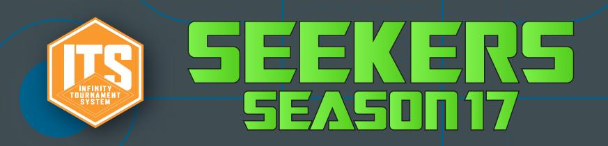

## FINAL SCORES

Once the last Tournament Round has finished, it is the duty of the Organizer to rank the players according to their total Tournament Points scores.

The winner of the tournament is the player who ranked first, that is, the one with the highest Tournament Points score.

If two or more players are tied for the same position, they are ranked according to their total Objective Points.

If both their Tournament Points and Objective Points scores are equal, players are ranked according to their total Victory Points. If this fails to break the tie, players are ranked according to the total of the Objective Points achieved by their opponents in the tournament.

## PAIRINGS

Pairings for the first Tournament Round are assigned at random.

From the second Tournament Round on, a Swiss system is used. Players are ranked according to their Tournament Points scores, and ties are broken by comparing total Objective Point scores. If the tie persists, compare the players' total Victory Points and, if this fails to break the tie, the total Objective Points achieved by their previous opponents in the tournament. Once all players are ranked, opponents are assigned in descending order of ranking (first against second, third against fourth, etc.).

## ODD NUMBER OF PLAYERS (BYES)

If the number of players in the tournament is not even, each Tournament Round one of the players will have to wait for the next Tournament Round to play; that player is said to be "given a bye". A player who takes a bye is awarded a Victory (worth 3 Tournament Points), 0 Objective Points and 0 Victory Points for that Round.

The Organizer must make sure that a single player is never given more than one bye during a tournament.

For the first Tournament Round, the player given a bye is determined at random. In subsequent Tournament Rounds, the player with the lowest ranking takes a bye, unless that player had already taken a bye in one of the previous Tournament Rounds. In that case, the player with the next lowest ranking who had not previously taken a bye is given the bye.

When players take a bye, they must make a note of it in their Tournament Control Sheet. Once the last Tournament Round ends, players who were given a bye follow these steps:

- ^ Add up all Objective Points the player earned during the tournament.
- ^ Multiply the result by the number of Tournament Rounds of the tournament.
- ^ Divide the result by the number of Tournament Rounds played (one less than the total Tournament Rounds of the tournament) and then round up.
- ^ The end result is their final Objective Points score. In the event of a tie, repeat the process with the player's Victory Points.

## ARMY LISTS

Each player is obligated to submits one or two Army Lists to the CorvuSphere, both from a single Generic or Sectorial Army.

Lists must observe all rules for army building set forth in the Infinity rulebooks.

Each player must bring two printed copies of each of their Complete Army Lists – the lists that contain all of the army's information, Open and Private – and give one to the Organizer before the first Tournament Round begins. Additionally, every player must carry a printed copy of each Courtesy Army List. This version contains only the list's Open Information so it can be shown to his adversaries upon request , but always after finishing the Deployment Phase.

The Tournament Organizer can require players turn in their Army Lists in advance to check their validity.

The only officially sanctioned Army List management tool for ITS play is Infinity Army, available for free on the Infinity website.

## CHOOSING AN ARMY LIST TO USE

Players choose which of their Army Lists to use in a Tournament Round at the beginning of that Round, after they have been informed of who their opponent is, what their Classified Objectives are, what faction they face, and which table they will be using.

## TOURNAMENT TIERS

Tournament Tiers determine the number of Army Points players can use to build their armies.

- ^ 400/350-Tier: 400 Army Points and 8 SWC, or 350 Army Points and 5 SWC.
- ^ 300/250-Tier: 300 Army Points and 6 SWC, or 250 Army Points and 5 SWC.
- ^ 200/150-Tier: 200 Army Points and 4 SWC, or 150 Army Points and 3 SWC.

The Organizer must make the Tournament Tier and the Army Points known when the event is first announced so players can take that into account when building their Army Lists

## SCENARIOS

The Organizer must choose an Official ITS Scenario for each Tournament Round. The same Scenario cannot be played twice during a tournament. The Organizer must make the chosen Scenarios known when the tournament is first announced so that players can take them into account when building their Army Lists.

In addition to the list of selectable Scenarios, the Organizer may add only one personalized Scenario to the tournament.

## DIAMETER OF ITS TOKENS

To make the work of an Organizer easier when preparing an ITS Tournament, this chart contains the diameters of all the Tokens that are used in the different missions.

| TOKEN            | DIAMETER |  |  |  |
|------------------|----------|--|--|--|
| Trans. Antenna   | 40mm     |  |  |  |
| Tech-Coffin      | 40mm     |  |  |  |
| Console          | 40mm     |  |  |  |
| Objective        | 40mm     |  |  |  |
| Supply Box       | 25mm     |  |  |  |
| Beacon           | 25mm     |  |  |  |
| Player A or B    | 25mm     |  |  |  |
| Data Pack        | 25mm     |  |  |  |
| Defensive Turret | 25mm     |  |  |  |
| CivEvac          | 25mm     |  |  |  |

#### SPECIALIST TROOPS

Only Hackers, Doctors, Engineers, Forward Observers, Paramedics, and Troopers possessing the Chain of Command or the Specialist Operative Special Skill are considered Specialist Troops.

# INFINITY TABLES

You can set up an Infinity table any way you like, there are many ways to do this and, as a player or tournament organizer, you should not be afraid to try different things, because there is not a single perfect way of doing it. The table setup will allow players to come up with their different strategies, which will make each game a unique experience.

However, those organizers who are planning their first tournaments will find here some tips from the community on how to set up Infinity tables.

## DENSITY OF TERRAIN

There is no minimum or maximum number of scenery elements that a gaming table must include. The key point is to strike a good balance in the amount of scenery used. It is best to avoid having wide open spaces without cover because moving around will be too hard, as well as to avoid layouts that are too densely packed with terrain and might keep troops with long-range weapons from getting a chance to shine.

Many tournament organizers recommend using nine large scenery elements, four to five mid-sized ones, and a good number of smaller elements that will provide cover and allow your troops to move around more safely.

However, the best way to learn how many terrain pieces you need for an Infinity game is by setting up lots of gaming tables. Experience and players' comments will become your reference for adapting to each game the amount of scenery you need.

## TERRAIN LAYOUT

You can find a guide to setting up Infinity gaming tables on the Infinity rulebook. However, here you will find a few additional tips that can be useful when you are organizing a tournament.

When setting up a gaming table, you can mentally divide it into quadrants, which will make it easier to distribute the scenery pieces more evenly and avoid having areas of the table where there is no cover for the troops.

It is important to check lines of fire, even along the edges of the table, as well as to try to avoid a layout of the terrain that would allow a sniper to control the entire table or a paratrooper to take the entire back edge of a Deployment Zone.

There is one important point that should not be overlooked: gaming tables can also be asymmetrical! This way, choosing your Deployment Zone at the beginning of the game takes on new importance. When this type of layout is used, both zones should be made interesting in different ways. For instance, one zone could have more elements for cover, while the other one could have wider open spaces, but offer some high vantage points.

You must make sure that all mission objectives cannot be controlled from a single point on the table. And of course, don't be shy about placing them on top of a scenery element: that is what Movement Skills are for!

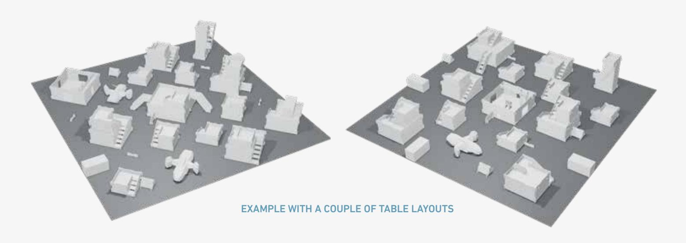

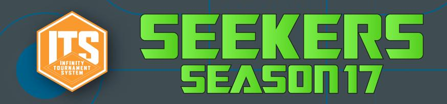

## THEMATIC TABLES

Anything can be used to set up an Infinity table! From a simple shoebox to an amazing building made by an official partner. As long as there is a good amount of cover so that the game does not become a mere shootout, it will be more than enough. But a table that looks good and "tells a story" will make for a much better gaming experience. It is not the same thing to infiltrate a secret facility located inside a futuristic building to steal some precious high-tech as to capture an important HVT who is just hiding between some cookie boxes.

A thematic table may also allow to take advantage of terrain rules and give troops with those skills a chance to stand out.

In a nutshell, taking into account the different skills of the troops when setting up the table will make for epic and memorable moments in each game.

# SEASON 17

During this season the following rules are applied:

## CIVILIANS IN INFINITY

Covert operations are the brand of Infinity, and those are usually highly precise and surgical missions executed when there is no one to witness, just to keep their secrecy.

However, sometimes the objectives of the mission can include civilians. In these situations, Troopers can interact with noncombatant personnel, performing what is called a CivEvac.

The rules of engagement however prevent causing harm to civilians.

#### EFFECTS

- ► A Civilian is a game element with a Unit Profile that does not belong to the Army List of any player.
- ► Therefore, Civilians cannot be part of any Combat Group and don't provide Orders to any Order Pool.
- ► Civilians are Neutral, unless some rule, Special Skill or piece of Equipment states the contrary.
- ► Civilians do not block LoF.
- ► Civilians do not provide CC MODs.
- ► Civilians ignore the Effects and Damage they could suffer, whether from an Attack or any other source. Therefore, they lack the ARM, BTS, and Wounds Attributes.
- ► Some Scenario Special Rules or mission Objectives can modify this rule.
- ► Civilians cannot activate Deployable weapons or pieces of Equipment.
- ► Civilians do not generate AROs.
- ► Templates that affect a Civilian are not cancelled, but will have no effect on the Civilian.

#### IMPORTANT

Being in Silhouette contact with a Civilian does not activate Engaged State.

| ISC: CIVILIAN                                 |    |    |    |     |     |     |      |   |     |
|-----------------------------------------------|----|----|----|-----|-----|-----|------|---|-----|
| MOV                                           | CC | BS | PH | WIP | ARM | BTS | VITA | S | AVA |
|                                               | 6  | 5  | 10 | 11  |     |     |      | 2 |     |
| CIVILIAN BS Weapon : ; CC Weapon: ; SWC: ; C: |    |    |    |     |     |     |      |   |     |

## CIVEVAC

This Common Skill allows a Model to control a Civilian in game.

#### **CIVEVAC**

#### **SHORT MOVEMENT SKILL**

Optional, Scenario.

#### **REQUIREMENTS**

- ► Only Models, and not Markers (Camouflage, for example) can perform this Common Skill. Any Marker which declares CivEvac is automatically revealed.
- ► Troopers must be in or reach Silhouette contact with the targeted Civilian.
- ► The targeted Civilian cannot be in Silhouette contact with an enemy Model, and cannot have a CivEvac Token.
- ► A Trooper cannot declare this Common Skill if any of the following is true:
  - ► It is already CivEvacing two Civilians.
  - ► It possesses the Impetuous Special Skill, or has gained it via the Frenzy Special Skill, or other game circumstance.
  - ► It possesses the Peripheral Special Skill.
  - ► Its Troop Type is REM or VH.
  - ► It is performing a Coordinated Order or is part of a Fireteam.

#### **EFFECTS**

- ► If the Trooper successfully passes a WIP+3 Roll, a Trooper can CivEvac the Civilian, placing a CivEvac Token by the Civilian to indicate this.
- ► If the roll is failed, this can be repeated as many times as necessary, each time spending the corresponding Short Skill and making the roll.
- ► The CivEvaced Civilian always remains in Silhouette contact with the Trooper which is CivEvacing it.
  - ► At the end of the Trooper's movement, place the Civilian in Silhouette contact with them. The Trooper must end their movement in a position where the Civilian can be placed in Silhouette contact.
- ► The maximum number of Civilians a Trooper can have CivEvaced with them is two.
- ► The Civilian must always be kept on the table, even if the Trooper which is CivEvacing it enters a Null State.
- ► In the following situations the CivEvac is automatically cancelled at the end of the Order, removing the CivEvac Token:
  - ► The Trooper that is CivEvacing the Civilian enters the Isolated State, any Null or Immobilized State, or any other State that indicates so.
  - ► The Trooper that is CivEvacing the Civilian becomes part of a Fireteam.
  - ► The Trooper that is CivEvacing the Civilian enters a State that replaces the Model with a Marker (Camouflaged, Impersonation, Holoecho…).
  - ► The Trooper that is CivEvacing the Civilian gains the Impetuous Skill via the Frenzy Special Skill, or other game circumstance.
- ► The Trooper can cancel the CivEvac voluntarily when activated by any Order or ARO, removing the CivEvac Token, with no Roll required.
- ► When the CivEvac is cancelled the Civilian must be left on a horizontal surface of the game table.
- ► If the Civilian is Hostile, due to any game condition or Scenario Special Rule, then the WIP Roll to CivEvac does not apply the +3 MOD.
- ► A Hostile Civilian is identified by a Hostile Token.

#### CIVILIAN RULE AND CIVEVAC GAME EXAMPLE

During her Active Turn, the PanOceanian player declares the first Basic Skill of her Orc Trooper: Move until they reach Silhouette contact with a Neoterran Corporate Executive, the PanOceanian HVT, a Civilian. With the second Short Skill of the Order, the player declares CivEvac and succeeds at a WIP+3 Roll, placing a CivEvac Token besides the HVT.

In the next Order, the PanOceanian player declares Move again as the first Short Movement Skill of their Orc Trooper. Now, the HVT will move in Silhouette contact with the Orc Trooper. In the second Short Movement Skill of the Order, the PanOceanian player declares Dodge to avoid an incoming Attack. As the Orc Trooper wins the Face to Face Roll, he can also Move up to 2 inches, with the HVT moving besides him in Silhouette contact. In the next Order, the PanOceanian player declares Jump, so the Orc Trooper and the HVT in Silhouette contact can move over an obstacle, placing them on the other side of it.

In a further Order, the PanOceanian player declares Move again as the first Short Movement Skill of their Orc Trooper. That move places the HVT in the Line of Fire of a Gangbuster. However, as Civilians don't trigger AROs, the O-12 Trooper cannot react. Then, the PanOceanian player declares the second short Skill of the Order: Move again. Now the Orc Trooper enters the Line of Fire (LoF) of the Gangbuster, who can declare an ARO: a BS Attack with his Light Riotstopper. As this is a Direct Template Weapon it affects the HVT. The PanOceanian player declares the second Short Skill of the Order: a BS Attack with his MULTI Rifle against the Gangbuster, because the HVT, as a Civilian, doesn't block LoF. The HVT will ignore the Effects of the Adhesive Ammunition. However, the Orc is affected normally by the Template and will have to perform a PH-6 Roll.

In the next Game Round, an Epsilon has used his Climbing Plus Special Skill to end a Move hanging halfway up a wall with a CivEvaced HVT in Silhouette contact. During the player's Active Turn, the Epsilon enters the Unconscious State. The HVT is no longer CivEvaced, so the player must remove the CivEvac Token and place the HVT on the game table, in contact with the wall, since the HVT cannot stay hanging halfway up the wall.

## DESIGNATED TARGET

In some scenarios, the enemy HVTs are considered enemy Troopers instead of Neutral Civilians, so they can be targeted by Attacks. HVTs that are Designated Targets are reactive and hostile, reacting as if they are an enemy Trooper. In these scenarios, players will use the following Trooper Profile for HVTs:

| ISC: (DESIGNATED TARGET) HVT                   |    |    |    |     |     |     |      |   |     |
|------------------------------------------------|----|----|----|-----|-----|-----|------|---|-----|
| MOV                                            | CC | BS | PH | WIP | ARM | BTS | VITA | S | AVA |
| 4-4                                            | 6  | 8  | 11 | 11  | 1   | 0   | 1    | 2 |     |
| DESIGNATED TARGET: Stun Pistol, PARA CC Weapon |    |    |    |     |     |     |      |   |     |
| SWC: C:                                        |    |    |    |     |     |     |      |   |     |

## CASEVAC

This skill allows Troopers to carry other figures that are in a Stunned, Immobilized, or Unconscious State.

#### **CASEVAC**

**SHORT SKILL**

Optional.

#### **REQUIREMENTS**

- ► Only Models and not Markers can perform this Common Skill. Any Marker which declares Casevac is automatically revealed.
- ► The Trooper must be in Silhouette contact with an allied Trooper in a Stunned, Immobilized (IMM-A or IMM-B), or Unconscious State. Some Scenario Special Rules may modify this.
- ► The Trooper must have a PH value equal to or greater than the PH value of the Trooper it intends to carry. Troopers with the Baggage piece of Equipment can ignore this Requirement.

#### **EFFECTS**

► This allows a Trooper to activate Casevac State

## CASEVAC STATE

#### CASEVAC

#### ACTIVATION

- ► A Trooper uses the Casevac Common Skill on an allied Trooper in Immobilized (IMM-A or IMM-B), Stunned, or Unconscious State.
- ► Troopers can only activate the Casevac state if they possess a **PH Attribute equal to or higher than the PH Attribute** of the Trooper they want to carry.

#### EFFECTS

- ► While in Casevac State, the player activates both Troopers with one single Order or ARO.
- ► In Casevac State, the player will move both troopers simultaneously in Silhouette contact, using the MOV values of the carrying Trooper.
- ► In this State, the carried Trooper (who is in an Immobilized, Stunned, or Unconscious State) cannot declare or perform Orders or AROs. Any Order or ARO will be always declared and performed by the carrying Trooper.
- ► In Casevac State, both Troopers provoke only one ARO from each enemy within LoF or ZOC.
- ► Players declaring an Attack with a Template Weapon against a Trooper that declared Casevac or the carried Trooper must apply the Template Weapons Into Close Combat rule.
- ► In Casevac State, the carried Trooper does not block LoF.
- ► In Casevac State, the carried Trooper does **not** provide the MOD of +1 to B when engaging in CC.
- ► Unless a Special Scenario Rule indicates the contrary, a Trooper in Casevac State cannot carry more than one Immobilized, Stunned or Unconscious Trooper.

#### CANCELATION

- ► Casevac State is automatically cancelled if the Trooper that declared Casevac declares a Skill other than Cautious Movement, Climb, Dodge, Jump, Reset, or a Short Movement Skill.
- ► This State is also cancelled if the Trooper that declared Casevac is activated in the Impetuous Phase.
- ► In the same way, Casevac State is cancelled when the Trooper that declared Casevac the State enters any Immobilized or Null State, or any other State that indicates so.
- ► This State is also cancelled if the Trooper that declared Casevac enters a State which replaces the Model with a Marker (Camouflaged, Impersonation, Holoecho…).
- ► This State is automatically cancelled if the carried Trooper recovers from the Immobilized(IMM-A or IMM-B), Stunned, or Unconscious State.
- ► The Trooper that declared Casevac can cancel it voluntarily by spending a Short Skill of an Order, with no Roll required.

## LONG SERVICE

During this season any Trooper whose Trooper Classification is listed as 'Character' also have the Trooper Classification of Veteran Troop.

## TREASURE HUNTERS

During this Season players can include a Sāchā in their Army List.

In addition, when playing any scenario during this ITS Season:

- ^ Each player must deploy one Treasure Token (25mm) at the beginning of their Deployment Phase.
- ^ The players must deploy their Treasure Tokens a minimum of 4 inches outside of any Deployment Zones. Moreover, the players cannot place their Treasure Tokens either on top of or inside of any Scenery Item or Building, always deploying them in an accessible location on the table.

At the end of the game, the player can replace one of their Classified Objectives with Secure Treasure. This is an optional Classified Objective all players can choose, replacing one of the Classified Objectives they drew from the Classified Deck.

The Secure Treasure optional Classified Objective is accomplished when, at the end of the game, the player has one of their Troopers (who is not in a Null State) inside the Zone of Control of the enemy Treasure and at the same time, the Zone of Control of their own Treasure is free of enemy Troopers (not counting those in a Null State).

The Secure Treasure optional Classified Objective provides the same number of Objective Points the scenario provides for each normal Classified Objective accomplished.

A Classified Objective that has been renounced, to be used as an INTELCOM Card, cannot be replaced with Secure Treasure.

**A Sāchā can Secure Treasure even if the player's own Treasure Token is not free of enemy Troopers.**

**A player can only replace one of their Classified Objectives to Secure Treasure or Secure HVT.**

In addition, Sāchās can gain weapons and pieces of equipment from Treasure Tokens by using the Open Treasure Short Skill.

#### **OPEN TREASURE**

**SHORT SKILL**

Attack, Scenario

#### **REQUIREMENTS**

► The Trooper must be a Sāchā in Silhouette contact with a Treasure Token.

#### **EFFECTS**

- ► By spending one Short Skill, without needing to perform a Roll, the Sāchā can make a Roll on the Treasure Chart to obtain one weapon or piece of equipment. Once a success has been rolled, that Sāchā cannot use this Treasure Token again.
- ► A Treasure Token is not removed from the table after it has been opened.
- ► If the Sāchā rolls a weapon or piece of equipment they already have, they can repeat the roll on the Treasure Chart.

#### TREASURE CHART

| 1-2 | +1 ARM                  |    | Panzerfaust        |
|-----|-------------------------|----|--------------------|
| 3-4 | Light Flamethrower      |    | Monofilament CCW   |
| 5-6 | Grenades                |    | MOV 8-4            |
| 7-8 | DA CCW                  |    | MULTI Rifle        |
| 9   | Multiespectral Visor L1 | 17 | MULTI Sniper Rifle |
| 10  | EXP CCW                 | 18 | +4 ARM             |
| 11  | Adhesive Launcher Rifle | 19 | Mimetism (-6)      |
| 12  | +2 ARM                  | 20 | HMG                |

# EXTRAS

The Organizer may choose to use one or more of the following modifiers of the tournament format. In that case, the Organizer must specify which Extras will be used when the event is first announced.

## ESCALATION TOURNAMENT

The tournaments applying this Extra will only have three Tournament Rounds, independently of the number of players. The first Round will be played with a 200/150-Tier, the second Round with a 300/250-Tier and the last Round of the Tournament with a 400/350-Tier. The Organizer must make the Army Points known when the event is first announced. Each Round will apply the pertinent K factor of the tournament.

With this Extra, each player must have three Army Lists, each one adapted to the corresponding Tier.

## FREE GAME

This Extra removes the limit of 15 Troopers in an Army List. So, a player can use Army Lists with more than 15 Troopers in them.

## SPEC-OPS

This Extra allows players to field a Spec-Ops in their tournament lists (see Daedalus' Fall).

Spec-Ops can be customized with 12 Experience Points.

Players can use a differently customized Spec-Ops for each army list, but no alterations can be made during the tournament.

Spec-Ops configurations must be noted in writing along with the army list they are in.

The Spec-Ops have the Specialist Operative Special Skill and will be considered a Specialist Troop in those scenarios that state it, and can apply the Special Rules the scenario specifies for these Troopers.

Spec-Ops earn no further Experience Points during this type of tournament.

## SOLDIERS OF FORTUNE

This Extra lets players include Mercenary Troops in their Army List.

Players must respect the Availability within the Unit Profile, ignoring the limitations established by the Army or Sectorial.

Each player can include up to 85 points of Mercenary Troops in their Army List.

The Mercenary Troops can be different for each of the two player Army Lists.

Fielding mercenaries in this way COSTS 1 SWC in that Army List.

The use of this Extra does not allow duplication of Characters.

## DIRECT ACTION

The Direct Action extra consists of a complete set of four scenarios, which you will find at the end of this booklet, that don't make use of the Classified Deck or HVT Models.

This is the 'no frills' tournament extra. Without terrain rules or Classified Objective mechanics. Just a set of main objectives and your tactical skills versus those of your opponent.

If you have recently started playing Infinity and are eager to put your skills to the test right away, before learning the full mechanics of ITS tournaments, Direct Action is perfect for you. A set of scenarios that will allow you to focus on the mission at hand and test your tactical abilities. But make no mistake, because these scenarios are not easier: although they don't include all the ITS mechanics, they don't leave out anything else. In Direct Action, the mission comes first.

For veteran players who are well versed in Infinity, a word of warning: these are not the exact same scenarios you are familiar with. Objectives and scoring have been modified, so the game experience is different. Here your Terrain Special Skills will not give you advantages, and you won't enjoy the flexibility for scoring points that Classified Objectives offer. If you thought you were on safe ground, you are about to find out how wrong you were!

## REINFORCEMENTS

With this Extra, the Reinforcement Rules are used during the tournament (see the Reinforcements Annex). All players must use Reinforcements.

## RESILIENCE OPERATIONS

This tournament extra is a new and different way to play games. It will test the resilience of the players and their capacity to overcome unexpected difficulties.

As Official Events, all Tournaments must comply with the Basic Rules of ITS; with the exception that they do not use the ITS scenarios nor the Classified Deck. Players must use the Tactical Objectives Deck and the Battle Conditions Deck.

You will find the rules in the Resilience Operations section of this document.

# CLASSIFIED OBJECTIVES

In the Infinity Official Scenarios, the Classified Objectives are additional objectives a player can accomplish to get more Objective Points.

Usually, each Classified Objective provides 1 Objective Point, but this number can vary due to the special conditions of the scenario.

Each Classified Objective provides its Objective Points one time in each scenario. Even if the requirements of the Classified Objective are achieved again, it will not provide additional Objective Points

## CLASSIFIED OBJECTIVES SELECTION

The number of Classified Objectives that can be fulfilled during the mission is listed on the scenario report. In the ITS, players have only one way of choosing the Classified Objectives, with the Classified Deck.

Players draw their Classified Objectives after learning what mission will be played and what faction their opponent will be playing with, but always before choosing one of the two Army Lists shown to the tournament organizer.

## INTELCOM CARD

As stated in some scenarios, it is possible to renounce the use of a Classified Objective, to use it as INTELCOM Card (Support and Control, or Interference).

Before the beginning of the game, but after choosing the Classified Objective, each player must decide if that card will be their Classified Objective or their INTELCOM Card, announcing their decision to their adversary. Each player rolls a die and the one who gets the highest score must make their decision first and inform their adversary. The content of the card, whether the mission, the card numeric value or symbol, is Private Information, no matter which use the player has chosen for it.

When specified in the mission, and in Initiative order, the player can use their INTELCOM Card.

## CLASSIFIED DECK

Each player must shuffle their own Classified Deck in front of their opponent and draw two cards for each Classified Objective determined in the scenario. He will be allowed to discard one of them. The discard will take place before drawing the next two cards for the following Classified Objective.

The Classified Objectives are Private Information until they are fulfilled. The player must keep their Classified Objective cards and show them to their opponent if he demands it once the Objective has been fulfilled.

## HIGH VALUE TARGET (HVT) MODEL

The HVT (High Value Target) represents a non-combatant character belonging to the enemy side and placed on the game table as the target of Classified Objectives.

The deployment of one of these Models is compulsory for both players, as their presence and interaction with other Troopers in-game has consequences for the achievement of Classified Objectives when playing scenarios.

You can use any figure from the Infinity or the Infinity Bootleg range, preferably those designated as HVT or as a Civilian. Good examples of this are the O-12 High Commissioner, the Tohaa Diplomat, the Freelance Stringer, Fusilier Angus, the VIP Executive or the HAZMAT A1 Specialist.

The HVT Models may be necessary to accomplish some Classified Objectives. However, these Models are especially useful when a player replaces one of their Classified Objectives with Secure the HVT.

#### REQUIREMENTS

- ► Each player must deploy one HVT Model at the beginning of their Deployment Phase.
- ► The players must deploy their HVT Models a minimum of 4 inches outside of any Deployment Zones. Moreover, the players cannot place their HVT Models either on top of or inside of any Scenery Item or Building, always deploying them in an accessible location on the table.

#### EFFECTS

► HVT Models are Neutral Civilians to both players.

## SECURE HVT CLASSIFIED OBJECTIVE

At the end of the game, the player can replace one of their Classified Objectives with Secure HVT. This is an optional Classified Objective all players can choose, replacing one of the Classified Objectives they drew from the Classified Deck.

The Secure HVT optional Classified Objective is accomplished when, at the end of the game, the player has one of their Troopers (who is not in a Null State) inside the Zone of Control of the enemy HVT and at the same time, the Zone of Control of their own HVT is free of enemy Troopers (not counting those in a Null State).

The Secure HVT optional Classified Objective provides the same number of Objective Points the scenario provides for each normal Classified Objective accomplished.

A Classified Objective that has been renounced, to be used as an INTELCOM Card, cannot be replaced with Secure HVT.

## TACTICAL SUPPORT

In official Infinity scenarios, Tactical Support offers additional tools to help players accomplish mission objectives or to furnish Troopers other bonuses.

## TACTICAL SUPPORT SELECTION

Each scenario specifies the number of Tactical Support options the player has. In ITS games, the selection of Tactical Support options must always be done using the Tactical Objectives Deck.

Players must draw their Tactical Support options after choosing one of their two Army Lists.

Each player must remove all the Tactical cards without a symbol from the Tactical Objective Deck (King of the Hill, Central Control, Z Domination and, N Domination). Then each player must shuffle their own Tactical Objective Deck in front of their opponent, and draw the number of cards specified in the scenario. Tactical Support options are Open Information.

The Trooper chosen to recieve a Tactical Support Option must be always one of the models deployed on the game table. Players are not allowed to choose Troopers in Hidden Deployment or in Marker state. This Trooper must always be on the game table as a Model and not as a Marker (Camouflaged, Holoecho…). Also, Irregular Troops and those whose Troop Type is REM or VH are not eligible to receive a Tactical Support Option.

The following chart indicates the effects of each Tactical Support option and when they need to be applied.

| SYMBOL | EFFECTS                                                                                               | WHEN IT IS USED                                                                                                                                                  |
|--------|-------------------------------------------------------------------------------------------------------|------------------------------------------------------------------------------------------------------------------------------------------------------------------|
|        | The player may apply the (ReRoll) MOD to a Skill with the Scenario Label. Single use.              | After failing a Roll.                                                                                                                                            |
|        | The player gets an automatic success when rolling for a Skill with the Scenario Label. Single use. | Before making a Roll.                                                                                                                                            |
|        | A Specialist Trooper may apply the (ReRoll) MOD to Skills with the Scenario Label.                 | At the end of the Deployment Phase, in Initiative order; the player chooses which Specialist Trooper from their Army List has this Effect during the game. |
|        | Wildcard. The player may pick any result of their choice from the chart.                           | When the Tactical Support card is drawn.                                                                                                                         |
|        | A Specialist Trooper of the player's choice has the Sensor Special Skill.                          | At the end of the Deployment Phase, in Initiative order; the player chooses which Specialist Trooper from their Army List has this Effect during the game. |
|        | A Trooper of the player's choice has the Specialist Operative Special Skill.                       | At the end of the Deployment Phase, in Initiative order; the player chooses which Trooper from their Army List has this Effect during the game.            |
|        | A Specialist Trooper of the player's choice has a MediKit.                                            | At the end of the Deployment Phase, in Initiative order; the player chooses which Trooper from their Army List has this Effect during the game.            |
|        | A Specialist Trooper of the player's choice has a GizmoKit.                                           | At the end of the Deployment Phase, in Initiative order; the player chooses which Trooper from their Army List has this Effect during the game.            |
|        | Cancel an Enemy Tactical Support option.                                                              | At the end of the Deployment Phase, in Initiative order.                                                                                                         |
|        | A Specialist Trooper of the player's choice has a Blitzen.                                            | At the end of the Deployment Phase, in Initiative order; the player chooses which Trooper from their Army List has this Effect during the game.            |
|        | A Specialist Trooper of the player's choice has an Adhesive Launcher Rifle.                        | At the end of the Deployment Phase, in Initiative order; the player chooses which Trooper from their Army List has this Effect during the game.            |
|        | The Lieutenant gets WIP +1 for the Initiative Roll.                                                   | During the Initiative Roll.                                                                                                                                      |

## ITS RANKING

Players' ITS Ratings change depending on their results in each tournament's rounds, as well as the event's K factor, as detailed in the ITS Basic Rules document.

## REPORTING RESULTS

In order to update the ITS Ranking with the results of a tournament, Organizers must report those results using the CorvuSphere found at <https://sphere.corvusbelli.com/>

Should you encounter any problems during the reporting process, please contact us at [tournament@corvusbelli.com](mailto:tournament@corvusbelli.com)

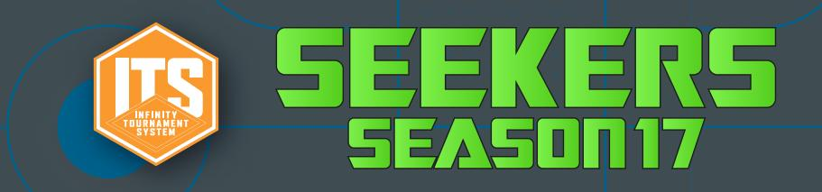

# ITS SCENARIOS

The tactical flexibility of the game mechanics of Infinity allows for the games to be much more than simply setting out to exterminate the enemy. In the ITS (Infinity Tournament System), the organized game system of Infinity, games are laid out with a set number of objectives to meet (e.g. take control of a building), or specific game conditions (e.g. Special Terrain Areas). These kinds of games are referred to as missions or scenarios, and they recreate tactical situations as well as operations from the military sphere and espionage circles of the highest levels. Granted, a mission or a scenario means a higher level of difficulty, requiring greater planning of the Army List as well as a more polished set of tactical and gaming abilities on the part of the player. However, they also mean a greater level of fun and entertainment than the regular extermination game.

*Thanks to the Warcor Tristan228 for his invaluable help and incredible work with the scenario maps.*

## **AKIAL INTERFERENCE**

TACTICAL SUPPORT OPTIONS 0 SUITABLE FOR REINFORCEMENTS YES

#### MISSION OBJECTIVES

#### **MAIN OBJECTIVES**

- Accomplish Common Classified Objectives (1 Objective Point for each, up to a maximum of 6 Objective Points).
- At the end of the game, have accomplished more Classified Objectives than the adversary (1 Objective Point).
- At the end of the game, have accomplished at least 1 Classified Objective in each Game Round (1 Objective Point, even if the Classified Objective gets canceled for that player).

#### CLASSIFIED

■ Each player has 1 Private Classified Objective (2 Objective Points).

#### FORCES AND DEPLOYMENT

SIDE A and SIDE B: Both players will deploy on opposite sides of the game table, in Deployment Zones whose size depends on the number of Army Points in the Army Lists.

| SIDE    | ARMY POINTS | swc | GAME TABLE SIZE | DEPLOYMENT ZONES SIZES |
|---------|----------------|-----|-----------------|---------------------------|
| A and B | 150            | 3   | 24 in x 32 in   | 8 in x 24 in              |
| A and B | 200            | 4   | 32 in x 48 in   | 12 in x 32 in             |
| A and B | 250            | 5   | 32 in x 48 in   | 12 in x 32 in             |
| A and B | 300            | 6   | 48 in x 48 in   | 12 in x 48 in             |
| A and B | 350            | 7   | 48 in x 48 in   | 12 in x 48 in             |
| A and B | 400            | 8   | 48 in x 48 in   | 12 in x 48 in             |

It is not allowed to deploy in Silhouette contact with the Akial Antenna or with any HVT.

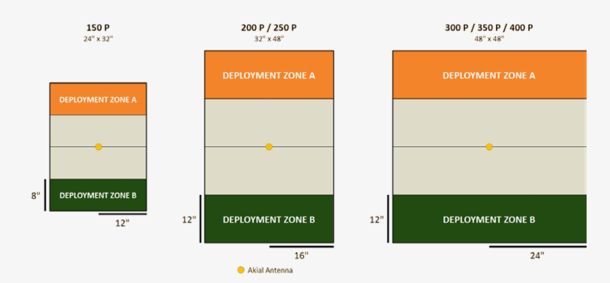

## SCENARIO SPECIAL RULES

#### COMMON CLASSIFIED OBJECTIVES

Both players share 2 Common Classified Objectives each Game Round, which are Public Information.

At the beginning of the first Game Round, each player must shuffle their Classified Deck in front of their opponent. Then each player must draw two cards, select one of them as their Private Classified Objective, and the other as a Common Classified Objective for the first Game Round. Once both players have selected a Common Classified Objective, they are revealed at the same time.

At the beginning of Game Rounds two and three, any current Common Classified Objective cards that have not been accomplished by either player are discarded. The Common Classified Objective cards that have been accomplished are moved to a separate area, so that each player can keep track of which cards have been accomplished. Player A and Player B Tokens can be used to mark which player has accomplished each Common Classified Objective card. It is recommended each player uses a different kind of Token.

Each player then draws two cards from their Classified Deck, chooses one as a Common Classified Objective, and discards the other.

Any Common Classified Objective that is checked "at the end of the game" or "during the game" can be accomplished at the end of any Player Turn. If both players accomplished the same Common Classified Objective in the same Turn, both players have accomplished it. A Common Classified Objective can only be accomplished after it has been drawn.

If a player's deck runs out of cards, shuffle their discard pile into a new deck.

#### PRIVATE CLASSIFIED OBJECTIVE

A Private Classified Objective cannot be used to Emit Akial Interference, and cannot be canceled by it.

The Private Classified Objectives are Private Information.

#### SIGNAL REDUNDANCY

If, upon revealing the Common Classified Objectives, both have the same name, the player with the first Player Turn must draw another card from their Classified Deck and place it as an extra Common Classified Objective.

Two Classified Objectives with the same name, whether Common or Private, can both be accomplished in the same Player Turn as long as they each have a different target or are accomplished by a different Trooper.

#### MULTIPLE HVTS

Each of the players will deploy four HVTs, following the usual rules for deploying HVTs. Each HVT may only be used to accomplish one Classified Objective - once a Classified Objective targeting an HVT has been completed, that HVT Model is removed from the game table.

#### SECURE HVT NOT USED

In this scenario, the Secure HVT rule is not applied.

#### AKIAL ANTENNA

There is 1 Akial Antenna placed in the center of the table.

The Akial Antenna must be represented by a Transmission Antenna Token (TRANS. ANTENNA) or with a scenery piece of the same diameter (such as the Antenna of the ITS Objective Pack Alpha, the Communications Array by Warsenal or the Sat Station Antenna by Customeeple).

#### **EMIT AKIAL INTERFERENCE**

**SHORT SKILL** 

Attack, Scenario

#### **REQUIREMENTS**

- ► Only Specialist Troops can declare this Skill.
- ► The Specialist Troop must be in Silhouette contact with the Akial Antenna
- ► The player has accomplished a Common Classified Objective that has any of those symbols: , , , .
- ► Each of those Common Classified Objective cards can only be chosen once for this Skill.
- ► Each Specialist Troop can only Emit Akial Interference once per Game Round.

#### **EFFECTS**

- ► Allows the Specialist Troop to make a Normal WIP Roll to Emit Akial Interference.
  - If the roll is failed, this can be repeated as many times as necessary, each time spending the corresponding Short Skill and making the roll.
- ► When Akial Interference is Emitted, the player may cancel a Common Classified Objective that has been accomplished by the adversary and that shares a symbol with a Common Classified Objective previously accomplished by the player.
- ► The adversary has no longer accomplished the chosen Common Classified Objective card. If neither player has accomplished the card, discard it.
- ► Only Common Classified Objective cards that have been accomplished count towards the final score total, or can be used to Emit Akial Interference.

#### **FILTER THE SIGNAL**

**SHORT SKILL** 

Attack, Scenario

#### **REQUIREMENTS**

- ► Only Specialist Troops can declare this Skill.
- ► The Specialist Troop must be in Silhouette contact with the Akial Antenna.

#### **EFFECTS**

- ► Without needing to perform a Roll, the player can Filter the Signal.
- ► When Filtering the Signal, the player chooses one of the current Common Classified Objective cards.
- ► If any player has accomplished the chosen card, it is placed with the other accomplished cards. If neither player has accomplished the card, discard it.
- ► The player draws a replacement card from their deck.

#### SPECIALIST TROOPS

For the purposes of this scenario, only Hackers, Doctors, Engineers, Forward Observers, Paramedics, and Troopers possessing the Chain of Command or the Specialist Operative Special Skill are considered Specialist Troops.

Hackers, Doctors, and Engineers cannot make use of Repeaters or Peripheral (Servant) Models to perform tasks reserved for Specialist Troops.

## END OF THE MISSION

This scenario has a limited time frame, so it will automatically finish at the end of the **third Game Round.**

If one of the players starts their Active Turn in a Retreat! situation, the game will end at the end of that Turn.

#### B-PONG

TACTICAL SUPPORT OPTIONS 2 SUITABLE FOR REINFORCEMENTS Y

YES

#### **MISSION OBJECTIVES**

#### **MAIN OBJECTIVES**

- At the end of the Game, the Tracking Beacon is totally inside the enemy half of the game table. (2 Objective Points).
- At the end of each Game Round, Control the Tracking Beacon (1 Objective Point).
- At the end of each Game Round, Control at least one Console (1 Objective Point).

#### CLASSIFIED

Each player has 2 Classified Objectives (1 Objective Point for each one).

#### FORCES AND DEPLOYMENT

SIDE A and SIDE B: Both players will deploy on opposite sides of the game table, in Deployment Zones whose size depends on the number of Army Points in the Army Lists.

| SIDE    | ARMY POINTS | swc | GAME TABLE SIZE | DEPLOYMENT ZONES SIZES |
|---------|----------------|-----|--------------------|---------------------------|
| A and B | 150            | 3   | 24 in x 32 in      | 12 in x 24 in             |
| A and B | 200            | 4   | 32 in x 48 in      | 16 in x 32 in             |
| A and B | 250            | 5   | 32 in x 48 in      | 16 in x 32 in             |
| A and B | 300            | 6   | 48 in x 48 in      | 16 in x 48 in             |
| A and B | 350            | 7   | 48 in x 48 in      | 16 in x 48 in             |
| A and B | 400            | 8   | 48 in x 48 in      | 16 in x 48 in             |

**Exclusion Zone.** The Exclusion Zone is the area covering 4 inches (2 inches in 150 point games) either side of the central line of the game table. Any Special Skill with the Airborne Deployment (AD) or Superior Deployment Labels cannot be used to deploy inside this area.

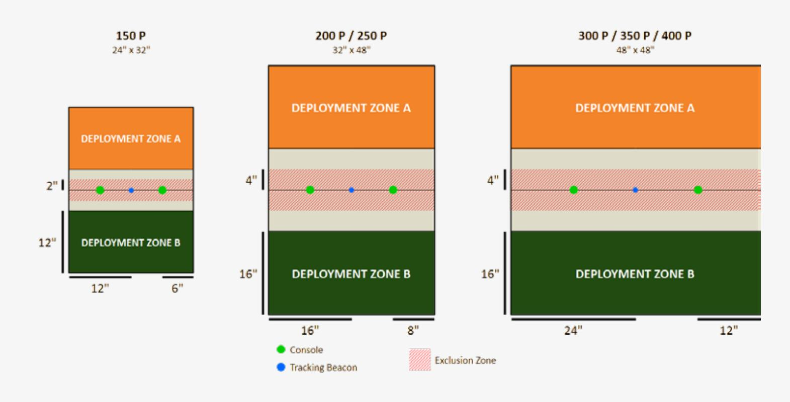

## SCENARIO SPECIAL RULES

#### TRACKING BEACON

There is 1 Tracking Beacon placed in the center of the table.

The Tracking Beacon must be represented by a Beacon Token (BEACON) or by a scenery piece of the same diameter (such as the Beacon from the ITS Objectives Pack Alpha, the Tactical Beacons by Micro Art Studio, the Tracking Beacons by Warsenal or the Mark One Beacons by Customeeple).

#### **RELOCATE THE TRACKING BEACON SHORT SKILL**

Attack, Scenario.

#### **REQUIREMENTS**

- ► Only Specialist Troops can declare this Skill.
- ► The Specialist Troop must be in Silhouette contact with the Tracking Beacon.
- ► Each Specialist Troop can only declare this Skill once per Game Round.

#### **EFFECTS**

- ► Spending one Short Skill, without needing to perform a Roll, the player can Relocate the Tracking Beacon.
- ► Place the Tracking Beacon anywhere within 4 inches of its previous position.

#### COMMON RULES OF THE TRACKING BEACON

When moving the Tracking Beacon, the following rules must be followed:

- ^ The final position of the Tracking Beacon must be fully supported by the surface it is placed on, and it cannot be placed on a vertical surface.
- ^ It must be possible to draw a path between the Tracking Beacon's starting and final positions. The path cannot be blocked by an impassable obstacle (for example a wall of infinite height, a closed door or sealed room...) or a gap too small for the diameter of the Tracking Beacon to pass through.
- ^ The Tracking Beacon is placed in its final position at the Conclusion of the Order.

#### CONTROL THE TRACKING BEACON

At the end of each Game Round, the Tracking Beacon is Controlled by a player as long as that player is the only one with at least one Trooper (as a Model, not a Marker) in Silhouette contact with it. So there cannot be any enemy Troopers in Silhouette contact with the Tracking Beacon. Models in a Null State cannot do either.

#### CONSOLES

There are two Consoles, placed on the central line of the game table. They are placed 12 inches from the table edges in 300/350/400 point games, 8 inches in 200/250 point games, and 6 inches in 150 point games (see map).

Each Console must be represented by a Console A Token or by a scenery piece of the same diameter (such as the Consoles from the ITS Objectives Pack Alpha, the Human Consoles by Micro Art Studio, the Tech Consoles by Warsenal or the Comlink Console by Customeeple).

#### **ACTIVATE CONSOLE**

**SHORT SKILL**

Attack, Scenario.

#### **REQUIREMENTS**

- ► Only Specialist Troops can declare this Skill.
- ► The Specialist Troop must be in Silhouette contact with the Console.
- ► The Tracking Beacon cannot be in Silhouette contact with a Trooper.
- ► An Activated Console can be Activated again by the other player, applying the same procedure. In this situation.
- ► Each Specialist Troop can only successfully Activate a Console once per Game Round.

#### **EFFECTS**

- ► Allows the Specialist Troop to make a Normal WIP Roll to Activate the Console. If the roll is failed, this can be repeated as many times as necessary, each time spending the corresponding Short Skill and making the roll.
- ► Once you successfully have Activated the Console, you must choose and perform one of the following actions:
  - ► **Nudge the Tracking Beacon:** Place the Tracking Beacon anywhere within 2 inches of its current position.
  - ► **Magnetize the Tracking Beacon:** Place the Tracking Beacon within 6 inches of its current position and directly towards the center of the game table. This action cannot be used to move the Tracking Beacon beyond the center of the table.

#### CONTROL THE CONSOLE

At the end of each Game Round, a Console is Controlled by a player as long as that player is the only one with at least one Trooper (as a Model, not a Marker) in Silhouette contact with it. So there cannot be any enemy Troopers in Silhouette contact with the Console. Models in a Null State cannot do either.

#### SPECIALIST TROOPS

For the purposes of this scenario, only Hackers, Doctors, Engineers, Forward Observers, Paramedics, and Troopers possessing the Chain of Command or the Specialist Operative Special Skill are considered Specialist Troops.

Hackers, Doctors, and Engineers cannot make use of Repeaters or Peripheral (Servant) Models to perform tasks reserved for Specialist Troops.

#### NO QUARTER

In this scenario, the Retreat! rules are not applied.

## END OF THE MISSION

This scenario has a limited time frame, so it will automatically finish at the end of the **third Game Round.**

#### CORPORATE APPROPRIATION

**TACTICAL SUPPORT OPTIONS** SUITABLE FOR REINFORCEMENTS YES

#### MISSION OBJECTIVES

#### **MAIN OBJECTIVES**

- At the end of the game, have the Enemy Prototype Captured (2 Objective Points).
- At the end of the game, have the Enemy Prototype Captured in your Deployment Zone (1 Objective Point, in addition to the previous Objective).
- At the end of the game, your Prototype is not Captured by the enemy (1 Objective Point, but only if your Prototype has not been Destroyed).
- At the end of the game, your Prototype is Destroyed (3 Objective Points).
- At the end of the game, have acquired more weapons or items from the Panoplies than the adversary (1 Objective Points).

**CLASSIFIED** 

Each player has 3 Classified Objectives (1 Objective Point for each one).

#### FORCES AND DEPLOYMENT

SIDE A and SIDE B: Both players will deploy on opposite sides of the game table, in Deployment Zones whose size depends on the number of Army Points in the Army Lists.

| SIDE    | ARMY POINTS | swc | GAME TABLE SIZE | DEPLOYMENT ZONES SIZES |
|---------|----------------|-----|--------------------|---------------------------|
| A and B | 150            | 3   | 24 in x 32 in      | 8 in x 24 in              |
| A and B | 200            | 4   | 32 in x 48 in      | 12 in x 32 in             |
| A and B | 250            | 5   | 32 in x 48 in      | 12 in x 32 in             |
| A and B | 300            | 6   | 48 in x 48 in      | 12 in x 48 in             |
| A and B | 350            | 7   | 48 in x 48 in      | 12 in x 48 in             |
| A and B | 400            | 8   | 48 in x 48 in      | 12 in x 48 in             |

**Exclusion Zone.** The Exclusion Zone is the area covering 4 inches either side of the central line of the game table. Any Special Skill with the Airborne Deployment (AD) or Superior Deployment Labels cannot be used to deploy inside this area.

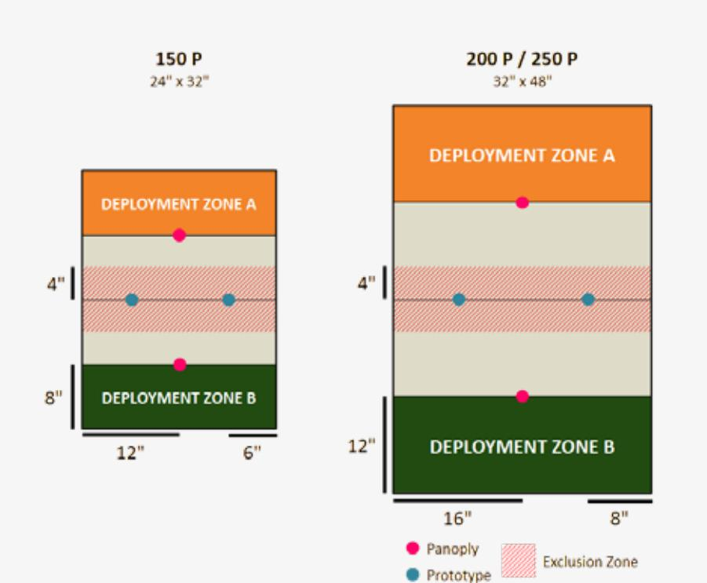

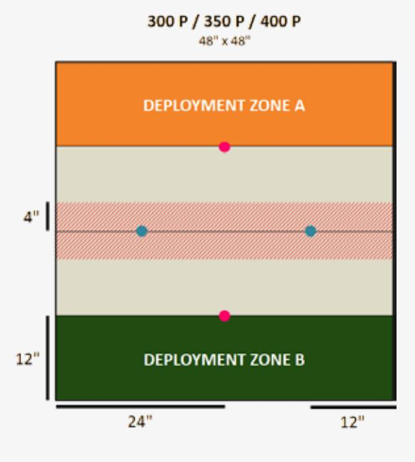

## SCENARIO SPECIAL RULES

#### PROTOTYPE

There are 2 Prototypes, 1 belonging to each player, on the central line of the table. They are placed 12 inches from the table edges in 300/350/400 point games, 8 inches in 200/250 point games, and 6 inches in 150 point games.

Before the Deployment Phase, the player with the second Turn decides which Prototype belongs to which player.

Each Prototype must be represented by an Objective Token or by a scenery piece of the same diameter (such as the Objective of the ITS Objectives Pack or the Alpha Info Hubs by Micro Art Studio).

In this scenario the Prototypes have a Profile and can be targeted.

| NAME                              | ARM | BTS | STR | S |  |  |  |
|-----------------------------------|-----|-----|-----|---|--|--|--|
| Prototype                         | 6   | 6   | 3   | 3 |  |  |  |
| FIXED CC ROLL= 8, GIZMOKIT (PH=9) |     |     |     |   |  |  |  |

### AUTOMATED DEFENSE SYSTEM (ADS)

Every Prototype is equipped with an ADS to avoid tampering with the Prototype system. Any CC Attack made against the Prototype will trigger a CC Attack in reaction, which automatically rolls an 8. Any CC Attack against the Prototype is automatically a Face to Face Roll. No MODs can be applied to the attacker's CC Attribute.

If the ADS's Roll of 8 is a success, the attacker suffers a Stun Ammunition hit, forcing them to make one Saving Roll against BTS, with PS 5. The Immunity (Enhanced) and Immunity (BTS) Special Skills are not effective against this hit.

#### DESTROY THE PROTOTYPES

A Prototype can only be damaged by CC Attacks with Weapons possessing the Anti-materiel Trait, or by placing D-Charges.

The Prototype is Destroyed and must be removed from the gaming table when it suffers a number of Wounds equal or higher than its STR Attribute value.

The Prototype can be the target of the Engineer Special Skill or the GizmoKit piece of Equipment

Prototypes cannot be attacked during the first Game Round.

#### **PICK UP PROTOTYPE**

**SHORT SKILL** 

Attack, Scenario

#### **REQUIREMENTS**

The Trooper must be in one of the following situations:

- ► Be in Silhouette contact with an allied Trooper in a Normal State with an Enemy Prototype.
- ► Be in Silhouette contact with an unaccompanied Enemy Prototype Token.

#### **EFFECTS**

- ► Spending one Short Skill, without needing a Roll, any Trooper can pick up an Enemy Prototype in any of the situations previously mentioned.
- ► The Trooper must follow the Common Rules of Prototypes.

#### COMMON RULES OF PROTOTYPES

- ^ A Trooper carrying a Prototype cannot declare Move as the second Basic Short Skill of an Order. As an exception, Troopers possessing the Baggage Special Skill can declare Move as the second Basic Short Skill of the Order.
- ^ Only Models, and not Markers, (Camo, Impersonation, Holoechoes…) can carry the Prototypes.
- ^ The Prototype Token must always be kept on the table.
- ^ The Prototype Token always remains in Silhouette contact with the Trooper which is carrying it.
- ^ If the Trooper carrying the Prototype enters or is in any Null State, they drop the Prototype. Move the Prototype slightly out of Silhouette contact with the Trooper
- ^ Prototype Tokens do not block movement or LoF.

#### CONTROLLING ENEMY PROTOTYPE

A Enemy Prototype is Controlled by a player if, at the end of the game, that player has a Model, but not a Marker, carrying it. That Trooper cannot be in a Null State or in Silhouette contact with any enemy Model.

#### PANOPLIES

There are a total of 2 Panoplies, placed in different halves of the table, each in the middle of the front edge of the Deployment Zone. (see map)

Each Panoply must be represented by an Objective Token or by a scenery piece of the same diameter (such as the Objective of the ITS Objectives Pack or the Alpha Info Hubs by Micro Art Studio).

#### **USE PANOPLIES**

**SHORT SKILL**

Attack, Scenario.

#### **REQUIREMENTS**

► The Trooper must be in Silhouette contact with a Panoply.

#### **EFFECTS**

- ► By succeeding at a WIP Roll, a Trooper gains the D-Charges weapon or, if their player prefers, makes a Roll on the Panoply Chart to obtain one different weapon or piece of equipment. Once a success has been rolled, that Trooper cannot use this Panoply again.
- ► Troopers possessing the Booty Special Skill, or any other Skill which specifies so, don't need to make the WIP Roll.
- ► A Trooper in Silhouette contact with this piece of scenery may spend one Short Skill of an Order to cancel their Unloaded State.
- ► If a Trooper rolls a weapon or piece of equipment they already have, they can repeat the roll on the Panoply Chart.

#### SPECIALIST TROOPS

For the purposes of this scenario, only Hackers, Doctors, Engineers, Forward Observers, Paramedics, and Troopers possessing the Chain of Command or the Specialist Operative Special Skill are considered Specialist Troops.

Hackers, Doctors, and Engineers cannot make use of Repeaters or Peripheral (Servant) Models to perform tasks reserved for Specialist Troops.

## END OF THE MISSION

This scenario has a limited time frame, so it will automatically finish at the end of the **third Game Round.**

If one of the players starts their Active Turn in a Retreat! situation, the game will end at the end of that Turn.

#### PANOPLY CHART

| 1-2 | +1 ARM                                              | 13 | Panzerfaust                                              |
|-----|-----------------------------------------------------|----|----------------------------------------------------------|
| 3-4 | Light Flamethrower                               | 14 | Monofilament CC Weapon                                   |
| 5-6 | Grenades                                            | 15 | MOV 8-4                                                  |
| 7-8 | DA CC Weapon                                        | 16 | TAG: BS Attack (Shock) Other Troop Types: MULTI Rifle |
| 9   | Multispectral Visor L1                           | 17 | MULTI Sniper Rifle                                       |
| 10  | EXP CC Weapon                                       | 18 | TAG: Immunity (ARM) Other Troop Types: + 4 ARM        |
| 11  | Adhesive Launcher Rifle                          | 19 | Mimetism (-6)                                            |
| 12  | TAG: Immunity (AP) Other Troop Types: + 2 ARM | 20 | TAG: BS Attack (+1B) Other Troop Types: HMG           |

## CRITICAL INTERVENTION

TACTICAL SUPPORT OPTIONS 1 SUITABLE FOR REINFORCEMENTS YES

## MISSION OBJECTIVES

#### MAIN OBJECTIVES (ATTACKER)

- ^ Unlock the Data Console (1 Objective Point).
- ^ Extract the Data Pack from the Data Console (2 Objective Points).
- ^ The Trooper that Extracted the Data Pack is not Killed at the end of the game (1 Objective Point).
- ^ At the end of the game, the Trooper that Extracted the Data Pack is in your Deployment Zone and is not in a Null State (2 Objective Points).
- ^ At the end of the game, Dominate the Server Room (2 Objective Points).

| 150-POINT GAME   | 200-POINT GAME   | 250-POINT GAME   | 300-POINT GAME   | 350-POINT GAME   | 400-POINT GAME   | OBJECTIVE POINTS |
|------------------|------------------|------------------|------------------|------------------|------------------|---------------------|
| To Kill at least | To Kill at least | To Kill at least | To Kill at least | To Kill at least | To Kill at least | 1 Objective Point.  |
| 40 enemy Army    | 50 enemy Army    | 65 enemy Army    | 75 enemy Army    | 85 enemy Army    | 100 enemy Army   |                     |
| Points.          | Points.          | Points.          | Points.          | Points.          | Points.          |                     |

#### MAIN OBJECTIVES (DEFENDER)

- ^ Prevent the Attacker from Unlocking the Data Console (1 Objective Point).
- ^ Prevent the Attacker from Extracting the Data Pack from the Data Console (3 Objective Points).
- ^ Kill the Trooper that Extracted the Data Pack (2 Objective Points, only if the Attacker has Extracted the Data Pack).
- ^ At the end of the game, Dominate the Server Room (3 Objective Points).

| 150-POINT GAME   | 200-POINT GAME   | 250-POINT GAME   | 300-POINT GAME   | 350-POINT GAME   | 400-POINT GAME   | OBJECTIVE POINTS |
|------------------|------------------|------------------|------------------|------------------|------------------|---------------------|
| To Kill at least | To Kill at least | To Kill at least | To Kill at least | To Kill at least | To Kill at least | 2 Objective Points. |
| 75 enemy Army    | 100 enemy Army   | 125 enemy Army   | 150 enemy Army   | 175 enemy Army   | 200 enemy Army   |                     |
| Points.          | Points.          | Points.          | Points.          | Points.          | Points.          |                     |

#### CLASSIFIED

^ Each player has 1 Classified Objective (1 Objective Point).

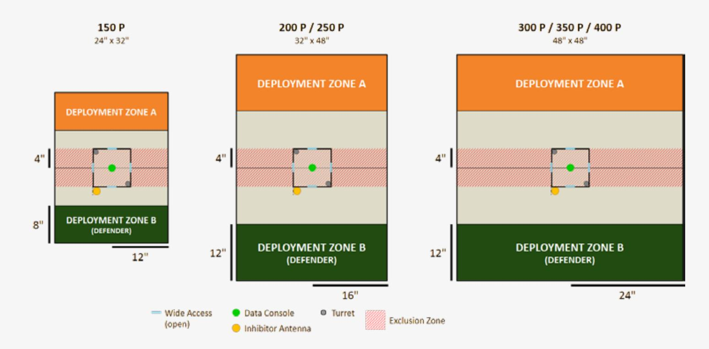

#### FORCES AND DEPLOYMENT

SIDE A and SIDE B: Both players will deploy on opposite sides of the game table, in Deployment Zones whose size depends on the number of Army Points in the Army Lists.

| SIDE    | ARMY POINTS | swc | GAME TABLE SIZE | DEPLOYMENT ZONE SIZES |
|---------|----------------|-----|--------------------|--------------------------|
| A and B | 150            | 3   | 24 in x 32 in      | 8 in x 24 in             |
| A and B | 200            | 4   | 32 in x 48 in      | 12 in x 32 in            |
| A and B | 250            | 5   | 32 in x 48 in      | 12 in x 32 in            |
| A and B | 300            | 6   | 48 in x 48 in      | 12 in x 48 in            |
| A and B | 350            | 7   | 48 in x 48 in      | 12 in x 48 in            |
| A and B | 400            | 8   | 48 in x 48 in      | 12 in x 48 in            |

It is not permitted to deploy inside the Server Room.

**Exclusion Zone (Attacker).** The Exclusion Zone is the area covering 4 inches either side of the central line of the game table. Any Special Skill with the Airborne Deployment (AD) or Superior Deployment Labels cannot be used to deploy inside this area.

#### SCENARIO SPECIAL RULES

#### ATTACKER AND DEFENDER

In this scenario, two distinct roles are established: Attacker and Defender. Each has different Main Objectives.

The player with the first Player Turn is the Attacker. The player with the second Player Turn is the Defender.

Before the Deployment Phase, the Defender may spend 1 single Command Token to perform one of the following actions:

- Activate the Server Room Defense System.
- Ignore the Deployment Restriction for the Server Room. You can deploy up to 65 points of Troops from your Army List, anywhere in the Server Room. This does not require the use of Special Skills with the Superior Deployment Label.

#### IMPORTANT

This use of a Command Token is in addition to the Strategic Use of Command Tokens.

#### SERVER ROOM

In this scenario the Server Room is a Zone of Operations (ZO).

Placed in the center of the table, it covers an area of 8 by 8 inches. To represent the Server Room, we recommend using the Objective Room by Micro Art Studio, the Command Bunker by Warsenal, or the Panic Room by Customeeple.

In game terms it is considered to have walls of infinite height that completely block Line of Fire. It has four Gates, one in the middle of each wall (see map). The Gates of the Server Room are open at the start of the game. The Server Room Gates must be represented by a Wide Gate Token or a scenery piece with the same size.

#### DOMINATE ZO

A Zone of Operations (ZO) is Dominated by a player if they have more Victory Points than the adversary inside the area. Only Troopers represented by Models or Markers (Camouflaged, Shasvastii-Embryo...) count, as well as Proxies and Peripheral Troops. Troops in a Null State do not count. Tokens representing weapons or pieces of equipment (like Mines or Deployable Repeaters), fake Holoechoes, and any Token that does not represent a Trooper does not count either.

A Trooper is inside a Zone of Operations when more than half the Trooper's base is inside that ZO.

#### SHASVASTII

Troopers possessing the Shasvastii Special Skill that are inside a Zone of Operations count while they are in the Shasvastii-Embryo State or any non-Null State.

#### BAGGAGE

Troopers possessing the Baggage piece of Equipment that are inside a Zone of Operations and in a non-Null State provide an additional 20 Victory Points for Dominating the ZO.

#### SERVER ROOM DEFENSE SYSTEM

There are 2 Armed Turrets, placed inside the Server Room in different corners (see map).

The Armed Turrets must be represented by a Defensive Turret A /B Token or by a Model or piece of scenery with the same

Silhouette value (for example Turrets from the ITS Objectives Pack Alpha).

If the Server Room's Defense System is active, the Armed Turrets function as Deployable Weapons placed by the Defender.

#### ARMED TURRET - DEFENSE SYSTEM

| MOV | CC | BS | PH | WIP | ARM | BTS | STR | S |
|-----|----|----|----|-----|-----|-----|-----|---|
|     | 5  | 10 |    | 11  | 2   | 3   | 1   | 2 |

Equipment: 360º Visor Special Skills: Total Reaction BS Weapons: Combi Rifle

CC Weapons: PARA CC Weapon (-3)

#### DATA CONSOLE

There is 1 Data Console placed in the center of the table. Inside the Data Console is 1 single Data Pack.

The Data Console must be represented by a Console A Token or by a scenery piece of the same diameter (such as the Consoles from the ITS Objectives Pack Alpha, the Human Consoles by Micro Art Studio, the Tech Consoles by Warsenal or the Comlink Console by Customeeple).

#### **EXTRACT DATA PACK**

**SHORT SKILL**

Attack, Scenario.

#### **REQUIREMENTS**

- ► Only Specialist Troops can declare this Skill.
- ► The Specialist Troop must be in Silhouette contact with the Data Console.

#### **EFFECTS**

- ► Allows the Specialist Troop to make a Normal WIP-6 Roll to Extract the Data Pack, with a successful roll a DATA PACK Token must be placed besides it.
- ► If the roll is failed, this can be repeated as many times as necessary, each time spending the corresponding Short Skill and making the roll.
- ► If the Data Console is Unlocked, the roll is a Normal WIP roll without the -6 MOD.

#### DATA PACK

The Data Pack must be represented by a DATA PACK Token.

The Trooper who has the Data Pack must always be on the game table as a Model and not as a Marker (Camouflaged, Holoecho…).

Once the Data Pack is Extracted, if the Trooper carrying it enters Dead State the DATA PACK Token must be removed from the game table.

#### INHIBITOR ANTENNA

There is an Inhibitor Antenna placed next to one of the outer corners of the Server Room in the Defender's half of the game table. (see map).

The Inhibitor Antenna must be represented by a Transmission Antenna Token (TRANS. ANTENNA) or with a scenery piece of the same diameter (such as the Antenna of the ITS Objective Pack Alpha, the Communications Array by Warsenal or the Sat Station Antenna by Customeeple).

#### **USE INHIBITOR ANTENNA**

**SHORT SKILL** 

Attack, Scenario

#### **REQUIREMENTS**

- ► Only Specialist Troops can declare this Skill.
- ► The Specialist Troop must be in Silhouette contact with the Inhibitor Antenna.

#### **EFFECTS**

- ► When declaring this Skill, you must choose one of the following actions:
- ► Unlock the Data Console.
- ► Activate or deactivate the Server Room Defense System.
- ► With a successful a Normal WIP Roll, the chosen action is performed.
- ► If the roll is failed, this can be repeated as many times as necessary, each time spending the corresponding Short Skill and making the roll.

#### SPECIALIST TROOPS

For the purposes of this scenario, only Hackers, Doctors, Engineers, Forward Observers, Paramedics, and Troopers possessing the Chain of Command or the Specialist Operative Special Skill are considered Specialist Troops.

Hackers, Doctors, and Engineers cannot make use of Repeaters or Peripheral (Servant) Models to perform tasks reserved for Specialist Troops.

#### KILLING

Troopers are considered Killed by the adversary when they enter Dead State, or they are in a Null State at the end of the game.

Troopers that **have not been deployed on the game table**, as a Model or Marker, at the end of the game will be considered to be Killed by the adversary.

#### INTELCOM CARD (SUPPORT AND CONTROL)

Before the beginning of the game, but after choosing the first Classified Objective, the player must inform to their adversary if that card will be their Classified Objective or their INTELCOM Card. Each player rolls a die and the one who gets the highest score must be the first who announces their decision to their adversary. The content of the card, whether the mission or the card numeric value, is Private Information, no matter which use the player has chosen for it.

At the end of the last Game Round, when the players count up their points and in Initiative order, the player can use their INTELCOM Card in Support and Control Mode.

**Support and Control Mode:** The player can add the value of the Support and Control Card to their Victory Points in the Zone of Operations (ZO) of their choice. The player must have at least one Trooper inside that ZO, in a non-Null State.

## END OF THE MISSION

This scenario has a limited time frame, so it will automatically finish at the end of the **third Game Round.**

If one of the players starts their Active Turn in a Retreat! situation, the game will end at the end of that Turn.

#### CROSSING LINES

TACTICAL SUPPORT OPTIONS 0 SUITABLE FOR REINFORCEMENTS N

NO

#### **MISSION OBJECTIVES**

#### **MAIN OBJECTIVES**

- At the end of each Game Round, Dominate a Dead Zone (1 Objective Point for each Dead Zone).
- At the end of the game, Dominate both Dead Zones (2 Objective Points).
- At the end of the game, have an Activated Antenna (1 Objective Point for each Activated Antenna).

#### CLASSIFIED

There are no Classified Objectives.

#### FORCES AND DEPLOYMENT

SIDE A and SIDE B: Both players will deploy on opposite sides of the game table, in Deployment Zones whose size depends on the number of Army Points in the Army Lists. Each player has a Deployment Zone in the rear of their half of the game table, and a second Deployment Zone in the other half of the game table, within the central strip.

| SIDE       | ARMY POINTS | swc | GAME TABLE SIZE | DEPLOYMENT ZONE SIZES                             |
|------------|----------------|-----|-----------------------|---------------------------------------------------|
| A and B | 150            | 3   | 24 in x 32 in      | 8 in x 24 in Central Strip zone: 4 in x 32 in  |
| A and B | 200            | 4   | 32 in x 48 in      | 12 in x 32 in Central Strip zone: 4 in x 48 in |
| A and B | 250            | 5   | 32 in x 48 in      | 12 in x 32 in Central Strip zone: 4 in x 48 in |
| A and B | 300            | 6   | 48 in x 48 in      | 12 in x 48 in Central Strip zone: 4 in x 48 in |
| A and B | 350            | 7   | 48 in x 48 in      | 12 in x 48 in Central Strip zone: 4 in x 48 in |
| A and B | 400            | 8   | 48 in x 48 in      | 12 in x 48 in Central Strip zone: 4 in x 48 in |

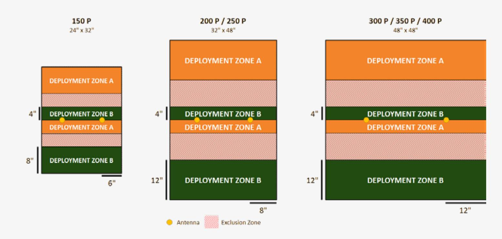

Players may deploy up to 75 points of Troops from their Army List in their Deployment Zone within the Central Strip.

It is not permitted to deploy in Silhouette contact with the Antennas.

**Exclusion Zone.** The Exclusion Zones are the areas between the Deployment Zones. Any Special Skill with the Airborne Deployment (AD) or Superior Deployment Labels cannot be used to deploy inside these areas.

## SCENARIO SPECIAL RULES

#### DEAD ZONE

There are two Dead Zones, one in each half of the game table. The Dead Zones are the areas between the Deployment Zones.

In this scenario each Dead Zone is a Zone of Operations (ZO).

#### DOMINATE ZO

A Zone of Operations (ZO) is Dominated by a player if they have more Victory Points than the adversary inside the area. Only Troopers represented by Models or Markers (Camouflaged, Shasvastii-Embryo...) count, as well as Proxies and Peripheral Troops. Troops in a Null State do not count. Tokens representing weapons or pieces of equipment (like Mines or Deployable Repeaters), fake Holoechoes, and any Token that does not represent a Trooper does not count either.

A Trooper is inside a Zone of Operations when more than half the Trooper's base is inside that ZO.

#### SHASVASTII

Troopers possessing the Shasvastii Special Skill that are inside a Zone of Operations count while they are in the Shasvastii-Embryo State or any non-Null State.

#### BAGGAGE

Troopers possessing the Baggage piece of Equipment that are inside a Zone of Operations and in a non-Null State provide an additional 20 Victory Points for Dominating the ZO.

#### ANTENNAS

There are 2 Antennas placed on the central line of the table. They are placed 12 inches from the table edges in 300/350/400 point games, 8 inches in 200/250 point games, and 6 inches in 150 point games (see map).

The Antennas must be represented by Transmission Antenna Tokens (TRANS. ANTENNA) or with scenery pieces of the same diameter (such as the Antenna of the ITS Objective Pack Alpha, the Communications Array by Warsenal or the Sat Station Antenna by Customeeple).

#### **ACTIVATE ANTENNA**

**SHORT SKILL**

Attack, Scenario.

#### **REQUIREMENTS**

- ► Only Specialist Troops can declare this Skill.
- ► The Specialist Troop must be in Silhouette contact with an Antenna.

#### **EFFECTS**

- ► Allows the Specialist Troop to make a Normal WIP Roll to Activate an Antenna.
- ► If the roll is failed, this can be repeated as many times as necessary, each time spending the corresponding Short Skill and making the roll.
- ► An Activated Antenna can be Activated again by the other player, applying the same procedure. In this situation, the Antenna is no longer Activated by the adversary.
- ► Player A and Player B Tokens can be used to mark the Activated Antenna. It is recommended each player uses a different kind of Token.

#### SUPERIOR DEPLOYMENT

With the exception of Impersonation, Special Skills with the Superior Deployment Label **cannot** be used in this scenario.

#### SPECIALIST TROOPS

For the purposes of this scenario, only Hackers, Doctors, Engineers, Forward Observers, Paramedics, and Troopers possessing the Chain of Command or the Specialist Operative Special Skill are considered Specialist Troops.

Hackers, Doctors, and Engineers cannot make use of Repeaters or Peripheral (Servant) Models to perform tasks reserved for Specialist Troops.

## END OF THE MISSION

This scenario has a limited time frame, so it will automatically finish at the end of the **third Game Round.**

If one of the players starts their Active Turn in a Retreat! situation, the game will end at the end of that Turn.

#### **EVACUATION**

TACTICAL SUPPORT OPTIONS 2 SUITABLE FOR REINFORCEMENTS Y

YES

#### **MISSION OBJECTIVES**

#### **MAIN OBJECTIVES**

- At the end of the game, have an Extracted Civilian (1 Objective Point for each one).
- At the end of the game, have an Extracted enemy HVT (1 Objective Point for each one).

#### **CLASSIFIED**

Each player has 2 Classified Objectives (2 Objective Points for each one).

#### FORCES AND DEPLOYMENT

SIDE A and SIDE B: Both players will deploy on opposite sides of the game table, in Deployment Zones whose size depends on the number of Army Points in the Army Lists

| SIDE    | ARMY POINTS | swc | GAME TABLE SIZE | DEPLOYMENT ZONES SIZES |
|---------|----------------|-----|--------------------|---------------------------|
| A and B | 150            | 3   | 24 in x 32 in      | 8 in x 24 in              |
| A and B | 200            | 4   | 32 in x 48 in      | 12 in x 32 in             |
| A and B | 250            | 5   | 32 in x 48 in      | 12 in x 32 in             |
| A and B | 300            | 6   | 48 in x 48 in      | 12 in x 48 in             |
| A and B | 350            | 7   | 48 in x 48 in      | 12 in x 48 in             |
| A and B | 400            | 8   | 48 in x 48 in      | 12 in x 48 in             |

It is not allowed to deploy in Silhouette contact with a Civilian.

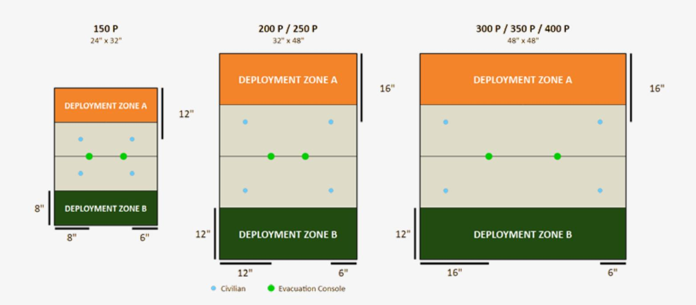

## SCENARIO SPECIAL RULES

#### CIVILIANS

There are a total of four Civilians on the game table, two of them in each table half. Each Civilian is placed 16 inches from the rear of the Deployment Zone and 6 inches from the edge of the table. (see the map).

For 150 point games, the Civilians are placed 12 inches from the rear of the Deployment Zone and 6 inches from the edges of the table. (see the map).

The Civilians cannot be placed on top of or inside of any Scenery Item or Building, always deploying them in accessible locations on the table. Scenery placement must facilitate this.

Players can use any Model from the Infinity or the Infinity Bootleg range, preferably those designated as HVT or as a Civilian. Good examples of this are the O-12 High Commissioner, the Tohaa Diplomat, Go-Go Marlene, the Fusilier Angus, the TAG Pilots, the VIP Executive or the HAZMAT A1 Specialist. Players can also use the Player A and Player B Tokens to identify or even represent their Civilians.

#### MULTIPLE HVTS

Each of the players deploys two HVTs, following the usual rules for deploying HVTs.

#### EXTRACTION CONSOLES

There are 2 Extraction Consoles, placed on the central line of the table. They are placed 16 inches from the edges of the table in 300/350/400 point games, 12 inches in 200/250 point games, and 8 inches in 150 point games (see map).

Each Console must be represented by a Console A Token or by a scenery piece of the same diameter (such as the Consoles of the ITS Objective Pack Alpha, the Human Consoles by Micro Art Studio, the Tech Consoles by Warsenal or the Comlink Console by Customeeple).

#### **ACTIVATE EXTRACTION CONSOLE SHORT SKILL**

Attack, Scenario.

#### **REQUIREMENTS**

- ► Only Specialist Troops can declare this Skill.
- ► The Specialist Troop must be in Silhouette contact with an Extraction Console.
- ► The Specialist Troop must be CivEvacing a Civilian or an Enemy HVT.
- ► This Skill cannot be declared during the first Game Round.

#### **EFFECTS**

- ► Allows the Specialist Troop to make a Normal WIP Roll to Activate an Extraction Console.
  - If the roll is failed, this can be repeated as many times as necessary, each time spending the corresponding Short Skill and making the roll.
- ► If the roll is successful, the player chooses one of the Specialist Troop's CivEvaced Civilians or Enemy HVTs. The chosen Civilian or HVT has been Extracted, and is removed from the game table.

#### SPECIALIST TROOPS

For the purposes of this scenario, only Hackers, Doctors, Engineers, Forward Observers, Paramedics, and Troopers possessing the Chain of Command or the Specialist Operative Special Skill are considered Specialist Troops.

Hackers, Doctors, and Engineers cannot make use of Repeaters or Peripheral (Servant) Models to perform tasks reserved for Specialist Troops.

#### OPERATIONAL LEARNING

When a Specialist Troop performs a **Skill with the Scenario Label** that requires a WIP Roll and **fails**, they benefit from the following MODs in subsequent Orders:

- ^ In the second consecutive Order, the Trooper applies a **+3 MOD to the WIP Roll** required for that Scenario Skill.
- ^ In the third consecutive Order—and subsequent Orders the Trooper applies **+3 and +1SD MODs to the WIP Roll** required for that Scenario Skill.
- ^ These MODs are cumulative with any other MOD that applies to Skills with the Scenario Label.

#### IMPORTANT

These MODs only apply to Rolls made in consecutive Orders by the same Trooper for the same Scenario Skill, with the same target, with no interruptions, or Orders spent on other Troopers:

- ^ If the Trooper passes the Roll, the sequence resets.
- ^ If the Trooper do not declare that Scenario Skill, the sequence resets.
- ^ If the Trooper declare the same Skill, but on a different target, the sequence resets.
- ^ If an Order is spent on any other Trooper, the sequence resets.
- ^ Only one sequence can be applied per Trooper and per Scenario-labelled Skill at a time.

## END OF THE MISSION

This scenario has a limited time frame, so it will automatically finish at the end of the **third Game Round.**

If one of the players starts their Active Turn in a Retreat! situation, the game will end at the end of that Turn.

#### HARDLOCK

TACTICAL SUPPORT OPTIONS 1 SUITABLE FOR REINFORCEMENTS Y

YES

#### **MISSION OBJECTIVES**

#### **MAIN OBJECTIVES**

- At the end of each Game Round, Control the Enemy Beacon (1 Objective Point).
- At the end of the game, your Beacon is not Controlled by the enemy (1 Objective Point).
- At the end of the game, have more Activated Consoles than the adversary (2 Objective Points).
- At the end of the game, have an Activated Console (1 Objective Point for each Activated Console).

#### CLASSIFIED

Each player has 1 Classified Objective (1 Objective Point).

#### FORCES AND DEPLOYMENT

SIDE A and SIDE B: Both players will deploy on opposite sides of the game table, in Deployment Zones whose size depends on the number of Army Points in the Army Lists.

| SIDE    | ARMY POINTS | swc | GAME TABLE SIZE | DEPLOYMENT ZONE SIZES |
|---------|----------------|-----|-----------------|--------------------------|
| A and B | 150            | 3   | 24 in x 32 in   | 8 in x 24 in             |
| A and B | 200            | 4   | 32 in x 48 in   | 12 in x 32 in            |
| A and B | 250            | 5   | 32 in x 48 in   | 12 in x 32 in            |
| A and B | 300            | 6   | 48 in x 48 in   | 12 in x 48 in            |
| A and B | 350            | 7   | 48 in x 48 in   | 12 in x 48 in            |
| A and B | 400            | 8   | 48 in x 48 in   | 12 in x 48 in            |

It is not permitted to deploy in Silhouette contact with the Beacons or with the Consoles.

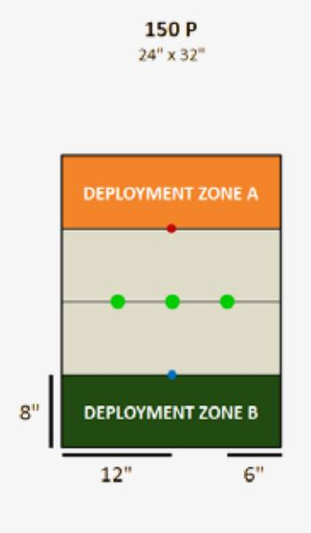

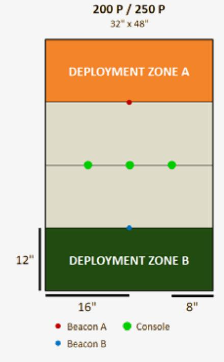

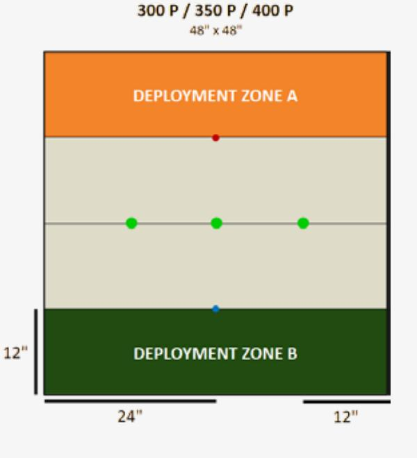

## SCENARIO SPECIAL RULES

#### BEACONS

There are a total of 2 Beacons, 1 corresponding to each player, placed in different halves of the table, each in the middle of the front edge of the Deployment Zone. (see map).

The Enemy Beacon is the one on the edge of the enemy Deployment Zone.

#### **PICK UP BEACON**

**SHORT SKILL**

Attack, Scenario.

#### **REQUIREMENTS**

► Have an Activated Console.

Also, the Trooper must be in one of the following situations:

- ► The Trooper is in Silhouette contact with a friendly Trooper in a Normal State that has an Enemy Beacon.
- ► The Trooper is in Silhouette contact with an Enemy Beacon which has no enemy Troops in a non-Null State in contact with it.

#### **EFFECTS**

- ► A Trooper can pick up an Enemy Beacon in any of the situations previously mentioned by spending one Short Skill, without needing to perform a Roll.
- ► The Troopers must follow the Common Rules of Beacons.

#### COMMON RULES OF BEACONS

- ^ Each Model can carry a maximum of 1 Beacon. As an exception, Troopers possessing the Baggage Special Skill can carry up to 2 Beacons.
- ^ Only Models, and not Markers, (Camouflaged, Impersonation, Holoechoes…) can carry the Beacons.
- ^ The Beacon must always be kept on the table.
- ^ The Beacon always remains in Silhouette contact with the Trooper which is carrying it.
- ^ If the Trooper carrying the Beacon enters or is in any Null State, they drop the Beacon. Move the Beacon slightly out of Silhouette contact with the Trooper.
- ^ Beacons do not block movement or LoF.

#### CONTROL AN ENEMY BEACON

An Enemy Beacon is Controlled by a player as long as that player is the only one with at least one Trooper (as a Model, not a Marker) in Silhouette contact with it. So there cannot be any enemy Troopers in Silhouette contact with the Beacon. Models in a Null State cannot do either.

#### CONSOLES

There are three Consoles, placed on the central line of the game table. One of them is in the center of the table, and the other two are placed 12 inches from the table edges in 300/350/400 point games, 8 inches in 200/250 point games, and 6 inches in 150 point games (see map).

Each Console must be represented by a Console A Token or by a scenery piece of the same diameter (such as the Consoles of the ITS Objectives Pack Alpha, the Human Consoles by Micro Art Studio, the Tech Consoles by Warsenal or the Comlink Console by Customeeple).

#### **ACTIVATE CONSOLE**

**SHORT SKILL**

Attack, Scenario.

#### **REQUIREMENTS**

- ► Only Specialist Troops can declare this Skill.
- ► The Specialist Troop must be in Silhouette contact with a Console.

#### **EFFECTS**

- ► Allows the Specialist Troop to make a Normal WIP Roll to Activate a Console.
- ► If the roll is failed, this can be repeated as many times as necessary, each time spending the corresponding Short Skill and making the roll.
- ► An Activated Console can be Activated again by the other player, applying the same procedure. In this situation, the Console is no longer Activated by the adversary.
- ► Player A and Player B Tokens can be used to mark the Activated Console. It is recommended each player uses a different kind of Tokens.

#### SPECIALIST TROOPS

For the purposes of this scenario, only Hackers, Doctors, Engineers, Forward Observers, Paramedics, and Troopers possessing the Chain of Command or the Specialist Operative Special Skill are considered Specialist Troops.

Hackers, Doctors, and Engineers cannot make use of Repeaters or Peripheral (Servant) Models to perform tasks reserved for Specialist Troops.

## END OF THE MISSION

This scenario has a limited time frame, so it will automatically finish at the end of the **third Game Round.**

If one of the players starts their Active Turn in a Retreat! situation, the game will end at the end of that Turn.

#### LAST LAUNCH

TACTICAL SUPPORT OPTIONS 2 SUITABLE FOR REINFORCEMENTS Y

YES

#### **MISSION OBJECTIVES**

#### **MAIN OBJECTIVES**

- At the end of the game, have Extracted more Army Points than the adversary (2 Objective Points).
- At the end of the game, have Extracted more Specialist Troops than the adversary (2 Objective Points).
- At the end of the game, have Killed more Specialist Troops than the adversary (2 Objective Points).
- At the end of the game, have Killed the same number of Specialist Troops as the adversary (1 Objective Point).
- At the end of the game, Dominate the Launching Tower (1 Objective Point).

#### FORCES AND DEPLOYMENT

SIDE A and SIDE B: Both players will deploy on opposite sides of the game table, in Deployment Zones whose size depends on the number of Army Points in the Army Lists.

| SIDE    | ARMY POINTS | swc | GAME TABLE SIZE | DEPLOYMENT ZONES SIZES |
|---------|----------------|-----|--------------------|---------------------------|
| A and B | 150            | 3   | 24 in x 32 in      | 8 in x 24 in              |
| A and B | 200            | 4   | 32 in x 48 in      | 12 in x 32 in             |
| A and B | 250            | 5   | 32 in x 48 in      | 12 in x 32 in             |
| A and B | 300            | 6   | 48 in x 48 in      | 12 in x 48 in             |
| A and B | 350            | 7   | 48 in x 48 in      | 12 in x 48 in             |
| A and B | 400            | 8   | 48 in x 48 in      | 12 in x 48 in             |

It is not allowed to deploy inside the Launching Tower.

#### **CLASSIFIED**

Each player has 3 Classified Objectives (1 Objective Point for each one).

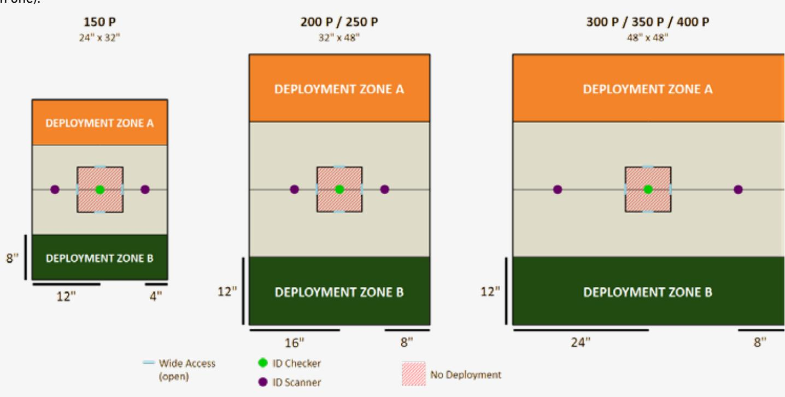

## SCENARIO SPECIAL RULES

#### ID SCANNERS

There are 2 ID Scanners placed on the central line of the table. They are placed 8 inches from the table edges (4 inches in 150 point games).

The ID Scanners must be represented by a Tech-Coffin Token or with a scenery piece of the same diameter (such as the Tech-Coffins of the ITS Objective Pack Alpha, the Stasis Coffins by Warsenal, or the Cryo Pods by Customeeple).

#### **DOWNLOAD ID**

**SHORT SKILL**

Attack, Scenario

#### **REQUIREMENTS**

- ► Only Specialist Troops can declare this Skill.
- ► The Specialist Troop must be in Silhouette contact with the ID Scanner.

#### **EFFECTS**

- ► Allows the Specialist Troop to make a Normal WIP Roll to Download an ID, with a successful roll an ID Token must be placed beside it.
- ► If the roll is failed, this can be repeated as many times as necessary, each time spending the corresponding Short Skill and making the roll.

#### **SWAP ID**

**SHORT SKILL**

Attack, Scenario

#### **REQUIREMENTS**

► The Trooper must be in Silhouette contact with an Allied Trooper with an ID Token.

#### **EFFECTS**

- ► Without needing to perform a Roll, the player can Swap the ID.
- ► Place the ID Token next to the Trooper that declared this Skill.

#### COMMON RULES OF ID TOKENS

- ^ A Trooper with an ID Token cannot enter or be in any Marker State.
- ^ A Trooper can only have a single ID Token at a time.
- ^ If a Trooper with an ID Token enters Dead State, remove their ID Token.

#### LAUNCHING TOWER (ZO)

In this scenario, the Launching Tower is a Zone of Operations (ZO). Placed in the center of the table, it covers an area of 8 by 8 inches. To represent the Launching Tower, we recommend using the Objective Room of the different Infinity Expansion Scenery Packs, the Objective Room by Micro Art Studio, the Command Bunker by Warsenal, or the Panic Room by Customeeple.

In game terms, it is considered to have walls of infinite height that completely block Line of Fire. It has four Wide Gates, one in the middle of each wall (see map). The Gates of the Launching Tower are open at the start of the game.

#### DOMINATE ZO

A Zone of Operations is Dominated by a player if they have more Victory Points than the adversary inside the area. Only Troopers represented by Models or Markers (Camouflaged, Shasvastii-Embryo, …) count, as well as Proxies and Peripheral Troops. Troops in a Null State do not count. Tokens representing weapons or pieces of equipment (like Mines or Deployable Repeaters), fake Holoechoes, and any Token that does not represent a Trooper do not count either.

A Trooper is inside the ZO when more than half the Trooper's base is inside that ZO.

#### SHASVASTII

Troopers possessing the Shasvastii Special Skill that are inside a Zone of Operations count while they are in Unconscious State or any non-Null State.

#### BAGGAGE

Each Trooper possessing the Baggage piece of Equipment that is Extracted provides an additional 20 points to the player's Extracted Army Points.

Troopers possessing the Baggage piece of Equipment that are inside a Zone of Operations and in a non-Null State provide an additional 20 Victory Points for Dominating the ZO

#### ID CHECKER

There is 1 ID Checker placed in the center of the Launching Tower.

The ID Checker must be represented by a Console A Token or by a scenery piece of the same diameter (such as the Consoles of the ITS Objectives Pack Alpha, the Human Consoles by Micro Art Studio, the Tech Consoles by Warsenal or the Comlink Console by Customeeple).

### **EXTRACT IDENTIFIED TROPPER**

**SHORT SKILL**

Attack, Scenario

#### **REQUIREMENTS**

- ► The Trooper must have an ID Token.
- ► The Trooper must be in Silhouette contact with the ID Checker.
- ► Troopers taking part in a Coordinated Order cannot declare this Skill.

#### **EFFECTS**

- ► Without needing to perform a Roll, the player can Extract the Trooper.
- ► Remove the Trooper from the game table, and any Peripherals it has that are inside the Launching Tower.
- ► Add the removed Troopers' points cost to the player's Extracted Army Points. Each player's Extracted Army Points total is Open Information.
- ► Troopers removed this way still count toward the player's Victory Points, even if they entered a Null State or Dead State during the Order they were Extracted.
- ► During a player's Tactical Phase, if their current Lieutenant has been extracted, apply the Loss of Lieutenant rule.

#### KILLING

Troopers are considered Killed by the adversary when they enter Dead State or are in a Null State at the end of the game.

Troopers that **have not been deployed on the game table**, as a Model or Marker, at the end of the game will be considered to be Killed by the adversary.

Troopers that have been Extracted are never considered to be Killed by the adversary.

#### SPECIALIST TROOPS

For the purposes of this scenario, only Hackers, Doctors, Engineers, Forward Observers, Paramedics, and Troopers possessing the Chain of Command or the Specialist Operative Special Skill are considered Specialist Troops.

Hackers, Doctors, and Engineers cannot make use of Repeaters or Peripheral (Servant) Models to perform tasks reserved for Specialist Troops.

#### NO QUARTER

In this scenario, the Retreat! rules are not applied.

## END OF THE MISSION

This scenario has a limited time frame, so it will automatically finish at the end of the **third Game Round.**

#### **PROVISIONING**

TACTICAL SUPPORT OPTIONS 1 SUITABLE FOR REINFORCEMENTS YES

#### **MISSION OBJECTIVES**

#### **MAIN OBJECTIVES**

- At the end of the game, Control a Supply Box (1 Objective Point for each Supply Box).
- At the end of the game, Control more Supply Boxes in your own Safe Area than your adversary in their own Safe Area (3 Objective Points).
- At the end of the game, Control the same number of Supply Boxes in your Safe Area than the adversary does in their Safe Area (1 Objective Point, but only if at least 1 Supply Box is Controlled in their Safe Area).
- At the end of the game, if your adversary does not Control any Supply Boxes in their Safe Area (2 Objective Points).

#### **CLASSIFIED**

■ Each player has 1 Classified Objective (1 Objective).

#### FORCES AND DEPLOYMENT

SIDE A and SIDE B: Both players will deploy on opposite corners of the game table, in Deployment Zones whose area depends on the number of Army Points in the Army Lists, measuring from the chosen corner.

| SIDE    | ARMY POINTS | swc | GAME TABLE SIZE | DEPLOYMENT ZONES |
|---------|----------------|-----|--------------------|------------------|
| A and B | 150            | 3   | 24 in x 32 in      | Radius of 12 in  |
| A and B | 200            | 4   | 32 in x 48 in      | Radius of 20 in  |
| A and B | 250            | 5   | 32 in x 48 in      | Radius of 20 in  |
| A and B | 300            | 6   | 48 in x 48 in      | Radius of 24 in  |
| A and B | 350            | 7   | 48 in x 48 in      | Radius of 24 in  |
| A and B | 400            | 8   | 48 in x 48 in      | Radius of 24 in  |

It is not allowed to deploy in Silhouette contact with a Tech-Coffin.

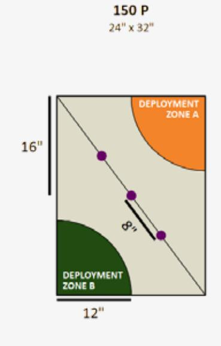

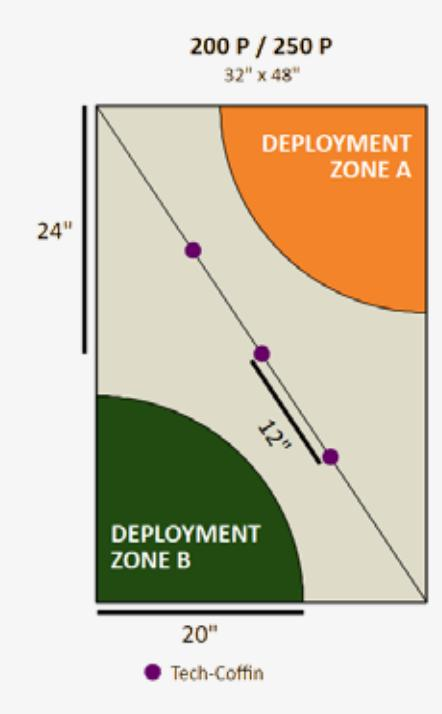

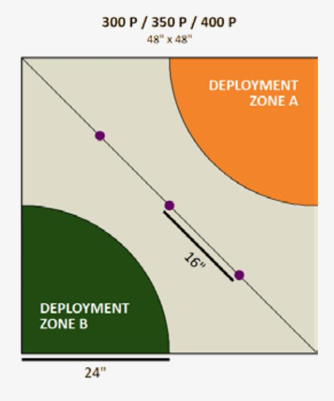

## SCENARIO SPECIAL RULES

#### TECH-COFFINS

There are a total of 3 Tech-Coffins. One of them is placed in the center of the table while the other two are placed along the central diagonal line of the table, at 16 inches from the central Tech-Coffin (12 inches in 200/250 point games, and 8 inches in 150 point games) (see map). Each Tech-Coffin contains one Supply Box, except for the central Tech-Coffin which contains **two Supply Boxes.**

The Tech-Coffins must be represented by a Tech-Coffin Marker or with a scenery piece of the same diameter (Such as the ITS Objective Pack Alpha, Stasis Coffins by Warsenal or the Cryo Pods by Customeeple).

#### SUPPLY BOXES

The Supply Boxes must be represented by a Supply Box Marker, or a similar scenery item (Such as the Supply Boxes of the ITS Objective Pack Alpha, the Tech Crates by Micro Art Studio, the Gang Tie Containers by Bandua Wargames, the Supply Boxes by Warsenal or the Cargo Crates by Customeeple)

#### REMEMBER

The central Tech-Coffin contains two Supply Boxes.

#### **EXTRACT SUPPLY BOXES**

**SHORT SKILL** 

Attack, Scenario

#### **REQUIREMENTS**

- ► Only Specialist Troops can declare this Skill.
- ► The Specialist Troop must be in base contact with a Tech-Coffin.

#### **EFFECTS**

- ► Allows the Specialist Troop to make a Normal **WIP** Roll to Extract and pick up the Supply Box, with a successful roll one SUPPLY BOX Token must be placed besides the Trooper.
- ► If the roll is failed, this can be repeated as many times as necessary, each time spending the corresponding Short Skill and making the roll.
- ► When all Supply Box Tokens have been Extracted from a Tech-Coffin, a Player A or Player B Token must be placed besides it to mark that the Supply Boxes have been extracted.

#### **PICK UP SUPPLY BOXES**

**SHORT SKILL** 

Attack, Scenario

#### **REQUIREMENTS**

The Trooper must be in one of the following situations:

- ► Be in Silhouette contact with an allied Trooper in a Normal State with a SUPPLY BOX Token.
- ► Be in Silhouette contact with an unaccompanied SUPPLY BOX Token. In addition:
- ► If the SUPPLY BOX Token is in the enemy's Safe Area, the Trooper must be a Specialist Troop.

#### **EFFECTS**

- ► Spending one Short Skill, without needing a Roll, the Trooper can pick up a Supply Box in any of the situations previously mentioned. Place the Supply Box Token in Silhouette contact with the Trooper.
- ► If the Supply Box is in the enemy's Safe Area, the Specialist Troop must pass a Normal WIP-3 Roll.
- ► The Trooper must follow the Common Rules of Supply Boxes.

#### COMMON RULES OF SUPPLY BOXES

- ^ Each Model can carry a maximum of 1 Supply Box. As an exception, Models possessing the Baggage Special Skill can carry up to 2 Supply Boxes.
- ^ Only Models, and not Markers, (Camo, Impersonation, Holoechoes…) can carry the Supply Boxes.
- ^ The Supply Box Token must always be kept on the table.
- ^ The Supply Box Token always remains in Silhouette contact with the Trooper which is carrying it.
- ^ If the Trooper carrying the Supply Box enters or is in any Null State, they drop the Supply Box. Move the Supply Box Token slightly out of Silhouette contact with the Trooper.
- ^ Supply Box Tokens don't block movement or LoF.

#### CONTROLLING THE SUPPLY BOXES

A Supply Box is Controlled by a player if, at the end of the game, that player has a Model, but not a Marker, carrying it. That Trooper cannot be in a Null State or in Silhouette contact with any enemy Model. Supply Boxes in a player's Safe Area are Controlled by that player unless an enemy Specialist Troop is carrying it.

#### SAFE AREA

Each player has a Safe Area where they must deposit the Supply Boxes.

Before the Deployment Phase, each player must place one Circular Template. It can be placed on any surface of the game table that is equal or larger in size than the Template, must be completely outside any Deployment Zones, and cannot overlap another Safe Area.

The player that kept Deployment must place their Circular Template first.

Any Trooper may put down a Supply Box in a Safe Area by spending one Short Skill, without needing to perform a Roll. The Trooper must place the Supply Box totally inside the Safe Area.

Only Specialist Troops may pick up a Supply Box from the enemy's Safe Area, using the Pick Up Supply Boxes Short Skill.

#### SPECIALIST TROOPS

For the purposes of this scenario, only Hackers, Doctors, Engineers, Forward Observers, Paramedics, and Troopers possessing the Chain of Command or the Specialist Operative Special Skill are considered Specialist Troops.

Hackers, Doctors, and Engineers cannot make use of Repeaters or Peripheral (Servant) Models to perform tasks reserved for Specialist Troops.

#### OPERATIONAL LEARNING

When a Specialist Troop performs a **Skill with the Scenario Label** that requires a WIP Roll and **fails**, they benefit from the following MODs in subsequent Orders:

- ^ In the second consecutive Order, the Trooper applies a **+3 MOD to the WIP Roll** required for that Scenario Skill.
- ^ In the third consecutive Order—and subsequent Orders the Trooper applies **+3 and +1SD MODs to the WIP Roll**  required for that Scenario Skill.
- ^ These MODs are cumulative with any other MOD that applies to Skills with the Scenario Label.

#### IMPORTANT:

These MODs only apply to Rolls made in consecutive Orders by the same Trooper for the same Scenario Skill, with the same target, with no interruptions, or Orders spent on other Troopers:

- ^ If the Trooper passes the Roll, the sequence resets.
- ^ If the Trooper do not declare that Scenario Skill, the sequence resets.
- ^ If the Trooper declare the same Skill, but on a different target, the sequence resets.
- ^ If an Order is spent on any other Trooper, the sequence resets.
- ^ Only one sequence can be applied per Trooper and per Scenario-labelled Skill at a time.

## END OF THE MISSION

This scenario has a limited time frame, so it will automatically finish at the end of the **third Game Round.**

If one of the players starts their Active Turn in a Retreat! situation, the game will end at the end of that Turn.

#### ZONE OF INTEREST

**TACTICAL SUPPORT OPTIONS** SUITABLE FOR REINFORCEMENTS

YES

#### MISSION OBJECTIVES

#### **MAIN OBJECTIVES**

- At the end of the game, Dominate a Zone of Interest (1 Objective Point for each Dominated Zone of Interest, up to a maximum of 3 Objective Points).
- At the end of each **GAME ROUND**, Dominate the Special Zone of Interest (1 Objective Point).
- At the end of each **GAME ROUND** have an Activated Communication Antenna (1 Objective Point).

#### **CLASSIFIED**

■ Each player has 1 Classified Objective (1 Objective Point).

#### FORCES AND DEPLOYMENT

SIDE A and SIDE B: Both players will deploy on opposite corners of the game table, in Deployment Zones whose area depends on the number of Army Points in the Army Lists, measuring from the chosen corner.

| SIDE    | ARMY POINTS | swc | GAME TABLE SIZE | DEPLOYMENT ZONES |
|---------|----------------|-----|--------------------|------------------|
| A and B | 150            | 3   | 24 in x 32 in      | Radius of 12 in  |
| A and B | 200            | 4   | 32 in x 48 in      | Radius of 20 in  |
| A and B | 250            | 5   | 32 in x 48 in      | Radius of 20 in  |
| A and B | 300            | 6   | 48 in x 48 in      | Radius of 24 in  |
| A and B | 350            | 7   | 48 in x 48 in      | Radius of 24 in  |
| A and B | 400            | 8   | 48 in x 48 in      | Radius of 24 in  |

It is not allowed to deploy inside of a Zone of Interest, or in Silhouette contact with the Communication Antenna.

24"

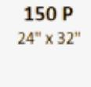

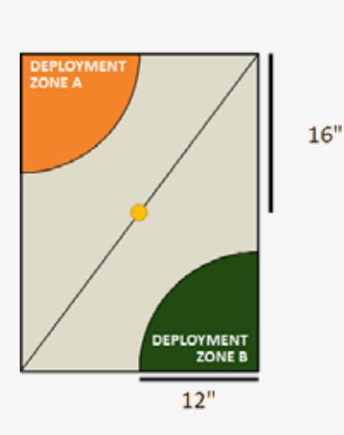

200 P / 250 P 32" x 48"

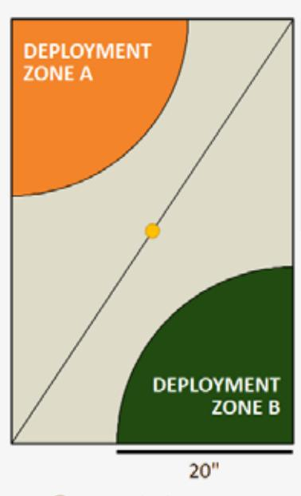

Communication Antenna

300 P / 350 P / 400 P

48" x 48"

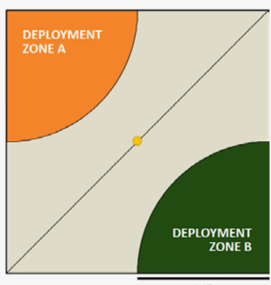

24"

## SCENARIO SPECIAL RULES

#### COMMUNICATION ANTENNA

There is 1 Communication Antenna placed in the center of the table.

The Communication Antenna must be represented by a Transmission Antenna Token (TRANS. ANTENNA) or with a scenery piece of the same diameter (such as the Antenna of the ITS Objective Pack Alpha, the Communications Array by Warsenal or the Sat Station Antenna by Customeeple).

#### **ACTIVATE COMMUNICATION ANTENNA SHORT SKILL**

Attack, Scenario

#### **REQUIREMENTS**

- ► Only Specialist Troops can declare this Skill.
- ► The Specialist Troop must be in Silhouette contact with the Communication Antenna.

#### **EFFECTS**

- ► Spending one Short Skill, without needing to perform a Roll, the Specialist Trooper Activates the Communication Antenna. If any enemy Hackers are within a Zone of Interest, this is instead a Face to Face WIP Roll.
- ► If the opponent has more than one Hacker within the Zones of Interest, they must choose one of those Hackers to make the Face to Face Roll.
- ► If the roll is failed, this can be repeated as many times as necessary, each time spending the corresponding Short Skill.
- ► An Activated Communication Antenna can be Activated again by the other player, applying the same procedure. In this situation, the Communication Antenna is no longer Activated by the adversary.
- ► Player A and Player B Tokens can be used to mark the Activated Communication Antenna. It is recommended each player uses a different kind of Tokens.

#### ZONE OF INTEREST

In this scenario the Zones of Interest are Zones of Operations (ZO), represented by Circular Templates.

There are a total of three Zones of Interest, one of which is the Special Zone of Interest.

Before the Deployment Phase, and in Initiative order, each player must place their Circular Templates. They can be placed on any surface of the game table that is equal or larger in size than the Template, must be completely outside any Deployment Zones, and cannot overlap another Zone of Interest.

The player with the first turn must place a Zone of Interest and the Special Zone of Interest, specifying which Template is the Special Zone of Interest when placing it. The player with second turn places a Zone of Interest.

#### DOMINATE ZO

A Zone of Operations (ZO) is Dominated by a player if they have more Victory Points than the adversary inside the area. Only Troopers represented by Models or Markers (Camouflaged, Shasvastii-Embryo...) count, as well as Proxies and Peripheral Troops. Troops in a Null State do not count. Tokens representing weapons or pieces of equipment (like Mines or Deployable Repeaters), fake Holoechoes, and any Token that does not represent a Trooper does not count either.

A Trooper is inside a Zone of Operations when more than half the Trooper's base is inside that ZO.

#### SHASVASTII

Troopers possessing the Shasvastii Special Skill that are inside a Zone of Operations count while they are in Unconscious State or any non-Null State.

#### BAGGAGE

Troopers possessing the Baggage piece of Equipment that are inside a Zone of Operations and in a non-Null State provide an additional 20 Victory Points for Dominating the ZO.

#### SPECIALIST TROOPS

For the purposes of this scenario, only Hackers, Doctors, Engineers, Forward Observers, Paramedics, and Troopers possessing the Chain of Command or the Specialist Operative Special Skill are considered Specialist Troops.

Hackers, Doctors, and Engineers cannot make use of Repeaters or Peripheral (Servant) Models to perform tasks reserved for Specialist Troops.

#### INTELCOM CARD (SUPPORT AND CONTROL)

Before the beginning of the game, but after choosing the first Classified Objective, the player must inform to their adversary if that card will be their Classified Objective or their INTELCOM Card. Each player rolls a die and the one who gets the highest score must be the first who announces their decision to their adversary. The content of the card, whether the mission or the card numeric value, is Private Information, no matter which use the player has chosen for it.

At the end of the last Game Round, when the players count up their points and in Initiative order, the player can use their INTELCOM Card in Support and Control Mode.

**Support and Control Mode:** The player can add the value of the Support and Control Card to their Victory Points in the Zone of Operations (ZO) of their choice. The player must have at least one Trooper inside that ZO, in a non-Null State.

## END OF THE MISSION

This scenario has a limited time frame, so it will automatically finish at the end of the **third Game Round.**

If one of the players starts their Active Turn in a Retreat! situation, the game will end at the end of that Turn.

# ITS DIRECT ACTION

## ANNIHILATION

TACTICAL SUPPORT OPTIONS 0 SUITABLE FOR REINFORCEMENTS YES

## MISSION OBJECTIVES

| 150-POINT GAME                | 200-POINT GAME     | 250-POINT GAME     | 300-POINT GAME     | 350-POINT GAME     | 400-POINT GAME      | OBJECTIVE POINTS |
|-------------------------------|--------------------|--------------------|--------------------|--------------------|---------------------|---------------------|
| To Kill 40 to 75              | To Kill 50 to 100  | To Kill 65 to 125  | To Kill 75 to 150  | To Kill 85 to 175  | To Kill 100 to      | 1 Objective Point.  |
| enemy Army                    | enemy Army         | enemy Army         | enemy Army         | enemy Army         | 200 enemy Army      |                     |
| Points.                       | Points.            | Points             | Points.            | Points             | Points.             |                     |
| To Kill 76 to 125             | To Kill 101 to     | To Kill 126 to     | To Kill 151 to     | To Kill 176 to     | To Kill 201 to      | 3 Objective Points. |
| enemy Army                    | 150 enemy Army     | 200 enemy Army     | 250 enemy Army     | 274 enemy Army     | 300 enemy Army      |                     |
| Points.                       | Points.            | Points.            | Points.            | Points.            | Points.             |                     |
| To Kill more than             | To Kill more than  | To Kill more than  | To Kill more than  | To Kill more than  | To Kill more than   | 4 Objective Points. |
| 125 enemy Army                | 150 enemy Army     | 200 enemy Army     | 250 enemy Army     | 275 enemy Army     | 300 enemy Army      |                     |
| Points.                       | Points.            | Points.            | Points.            | Points.            | Points.             |                     |
| If you have 40                | If you have 50     | If you have 65     | If you have 75     | If you have 85     | If you have 100     | 1 Objective Point.  |
| to 75 surviving               | to 100 surviving   | to 125 surviving   | to 150 surviving   | to 175 surviving   | to 200 surviving    |                     |
| Victory Points.               | Victory Points     | Victory Points.    | Victory Points.    | Victory Points.    | Victory Points.     |                     |
| If you have 76                | If you have 101    | If you have 126    | If you have 151    | If you have 176    | If you have 201     | 3 Objective Point.  |
| to 125 surviving              | to 150 surviving   | to 200 surviving   | to 250 surviving   | to 274 surviving   | to 300 surviving    |                     |
| Victory Points                | Victory Points.    | Victory Points     | Victory Points.    | Victory Points.    | Victory Points.     |                     |
| If you have more              | If you have more   | If you have more   | If you have more   | If you have more   | If you have more    | 4 Objective Points. |
| than 125 surviving            | than 150 surviving | than 200 surviving | than 250 surviving | than 275 surviving | than 300 surviving  |                     |
| Victory Points.               | Victory Points.    | Victory Points.    | Victory Points.    | Victory Points.    | Victory Points.     |                     |
| To Kill the enemy Lieutenant. |                    |                    |                    |                    | 2 Objective Points. |                     |

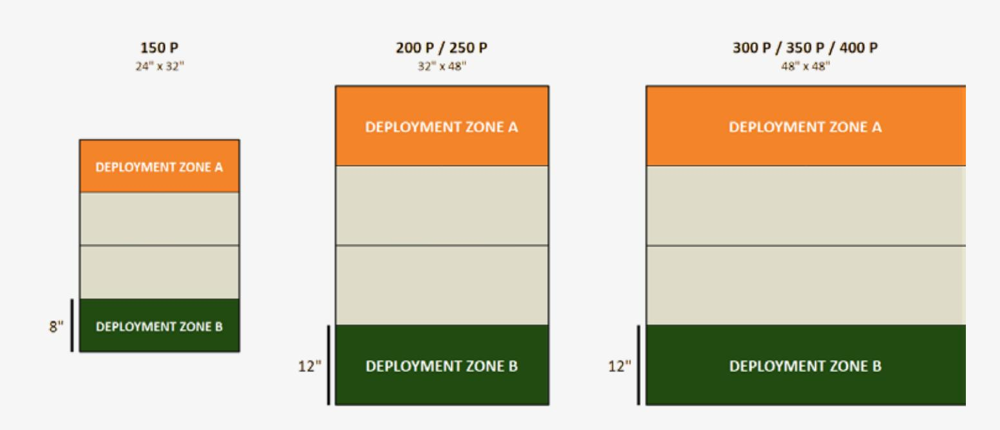

#### FORCES AND DEPLOYMENT

SIDE A and SIDE B: Both players will deploy on opposite sides of the game table, in Deployment Zones whose size depends on the number of Army Points in the Army Lists.

| SIDE    | ARMY POINTS | swc | GAME TABLE SIZE | DEPLOYMENT ZONES SIZES |
|---------|----------------|-----|--------------------|---------------------------|
| A and B | 150            | 3   | 24 in x 32 in      | 8 in x 32 cm              |
| A and B | 200            | 4   | 32 in x 48 in      | 12 in x 32 in             |
| A and B | 250            | 5   | 32 in x 48 in      | 12 in x 32 in             |
| A and B | 300            | 6   | 48 in x 48 in      | 12 in x 48 in             |
| A and B | 350            | 7   | 48 in x 48 in      | 12 in x 48 in             |
| A and B | 400            | 8   | 48 in x 48 in      | 12 in x 48 in             |

## SCENARIO SPECIAL RULES

#### **KILLING**

Troopers are considered Killed by the adversary when they enter Dead State, or they are in a Null State at the end of the game.

Troopers that **have not been deployed on the game table**, as a Model or Marker, at the end of the game will be considered to be Killed by the adversary.

#### **NO DUARTER**

In this scenario, the Retreat! rules are not applied.

#### HVT AND CLASSIFIED DECK NOT USED

In this scenario, the HVT Model and Secure HVT rules are not applied. Players will not deploy the HVT Model on the game table and they will not use the Classified Deck in this scenario.

#### END OF THE MISSION

This scenario has a limited time frame, so it will automatically finish at the end of the **third Game Round.** 

#### **BATTLEGROUND**

TACTICAL SUPPORT OPTIONS 0 SUITABLE FOR REINFORCEMENTS NO

#### **MISSION OBJECTIVES**

- At the end of the game, dominate the nearest Sector to your Deployment Zone (1 Objective Point).
- At the end of the game, dominate the central Sector (3 Objective Points).
- At the end of the game, dominate the farthest Sector from your Deployment Zone (4 Objective Points).
- Kill the enemy Key Ops (2 Objective Points).
- Alternatively, at the end of the game, Threaten the enemy Key Ops (1 Objective Point).

#### FORCES AND DEPLOYMENT

SIDE A and SIDE B: Both players will deploy on opposite sides of the game table, in Deployment Zones whose size depends on the number of Army Points in the Army Lists.

| SIDE    | ARMY POINTS | swc | GAME TABLE SIZE | DEPLOYMENT ZONES SIZES |
|---------|----------------|-----|-----------------|---------------------------|
| A and B | 150            | 3   | 24 in x 32 in   | 8 in x 24 in              |
| A and B | 200            | 4   | 32 in x 48 in   | 12 in x 32 in             |
| A and B | 250            | 5   | 32 in x 48 in   | 12 in x 32 in             |
| A and B | 300            | 6   | 48 in x 48 in   | 12 in x 48 in             |
| A and B | 350            | 7   | 48 in x 48 in   | 12 in x 48 in             |
| A and B | 400            | 8   | 48 in x 48 in   | 12 in x 48 in             |

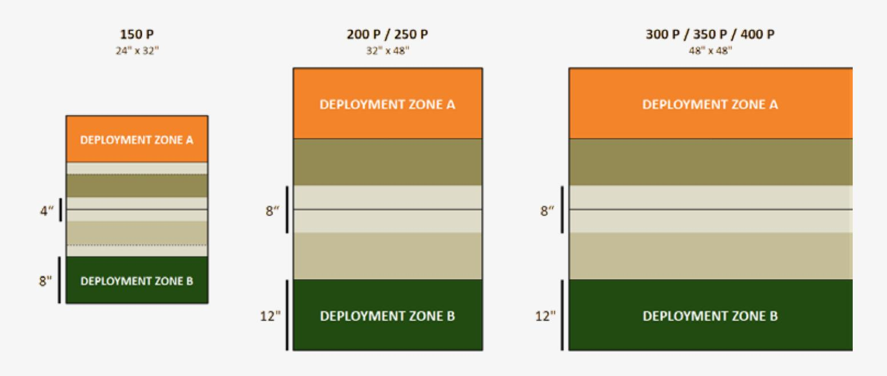

## SCENARIO SPECIAL RULES

#### SECTORS (ZO)

When the game is finished, but not before, 3 Sectors are marked out. In 200/250/300/350/400 point games, these Sectors are 8 inches deep and as wide as the game table. Two of these Sectors are placed 4 inches from the central line of the game table, one on each side, and the third Sector is a strip 8 inches deep in the central area of the table.

In 150 point games, these Sectors are 4 inches deep and as wide as the game table. Two of these Sectors are placed 2 inches from the central line of the game table, one on each side, and the third Sector is a strip 4 inches deep in the central area of the table.

In this scenario each Sector is a Zone of Operations (ZO).

#### DOMINATE ZO

A Zone of Operations (ZO) is Dominated by a player if they have more Victory Points than the adversary inside the area. Only Troopers represented by Models or Markers (Camouflaged, Shasvastii-Embryo...) count, as well as Proxies and Peripheral Troops. Troops in a Null State do not count. Tokens representing weapons or pieces of equipment (like Mines or Deployable Repeaters), fake Holoechoes, and any Token that does not represent a Trooper does not count either.

A Trooper is inside a Zone of Operations when more than half the Trooper's base is inside that ZO.

#### SHASVASTII

Troopers possessing the Shasvastii Special Skill that are inside a Zone of Operations count while they are in the Unconscious State or any non-Null State.

#### BAGGAGE

Troopers possessing the Baggage piece of Equipment that are inside a Zone of Operations and in a non-Null State provide an additional 20 Victory Points for Dominating the ZO.

#### KILLING

Troopers are considered Killed by the adversary when they enter Dead State, or they are in a Null State at the end of the game.

Troopers that **have not been deployed on the game table**, as a Model or Marker, at the end of the game will be considered to be Killed by the adversary.

#### KEY OPS

The Key Ops is a special tactics operator with unique training to conduct multi-domain reconnaissance and combat across the full spectrum of conflicts.

At the end of the Deployment Phase, in Initiative order, players must declare which Trooper from their Army List is their Key Ops. The Trooper chosen must be always one of the models deployed on the game table. Players are not allowed to choose Troopers in Hidden Deployment or in Marker state. This Trooper must always be on the game table as a Model and not as a Marker (Camouflaged, Holoecho…). Also, Irregular Troops and those whose Troop Type is REM or VH are not eligible to be Key Ops.

The Key Ops possesses the Dodge (+3) and Tactical Awareness Special Skills, even if those are not listed on their Unit Profile. These Special Skills are not cumulative, if the Trooper already has them, then they are not applied.

The Key Ops is identified with a Player A or B Marker.

#### THREATEN KEY OPS

A Key Ops is Threatened by a player if they have at least one Trooper (as a Model, not a Marker) in a non-Null state inside the Key Ops' Zone of Control.

#### HVT AND CLASSIFIED DECK NOT USED

In this scenario, the HVT Model and Secure HVT rules are not applied. Players will not deploy the HVT Model on the game table and they will not use the Classified Deck in this scenario.

## END OF THE MISSION

This scenario has a limited time frame, so it will automatically finish at the end of the **third Game Round.**

#### **CUTTHROAT**

TACTICAL SUPPORT OPTIONS 0 SUITABLE FOR REINFORCEMENTS YES

TES

#### **MISSION OBJECTIVES**

- ▼ To Kill more Army Points than the adversary (3 Objective Points).
- To Kill the same number of Lieutenants as the adversary (2 Objective Points, but only if at least 1 Lieutenant is killed by the player).
- To Kill more Lieutenants than the adversary (3 Objective Points).
- To Kill the enemy Key Ops (1 Objective Point).
- To Kill more enemy Troopers with your Key Ops than the adversary does with theirs (3 Objective Points).

#### FORCES AND DEPLOYMENT

SIDE A and SIDE B: Both players will deploy on opposite sides of the game table, in Deployment Zones whose size depends on the number of Army Points in the Army Lists.

| SIDE    | ARMY POINTS | swc | GAME TABLE SIZE | DEPLOYMENT ZONES SIZES |
|---------|----------------|-----|--------------------|---------------------------|
| A and B | 150            | 3   | 24 in x 32 in      | 12 in x 24 in             |
| A and B | 200            | 4   | 32 in x 48 in      | 16 in x 32 in             |
| A and B | 250            | 5   | 32 in x 48 in      | 16 in x 32 in             |
| A and B | 300            | 6   | 48 in x 48 in      | 16 in x 48 in             |
| A and B | 350            | 7   | 48 in x 48 in      | 16 in x 48 in             |
| A and B | 400            | 8   | 48 in x 48 in      | 16 in x 48 in             |

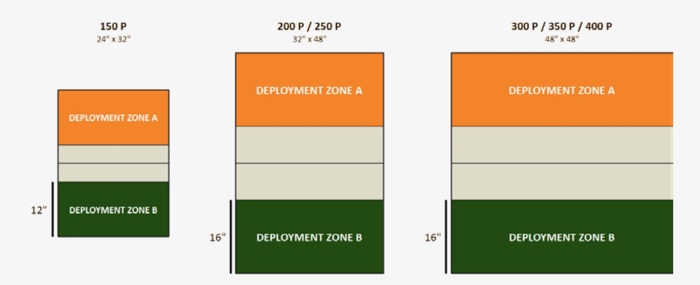

## SCENARIO SPECIAL RULES

#### REINFORCED TACTICAL LINK

In this scenario the Loss of Lieutenant rule does not apply.

In this mission, the identity of the Lieutenant is always Open Information. The player must indicate which Marker is the Lieutenant if it is in a Marker State (Camouflaged, Decoy...) or which Markers are the Lieutenant in the case of a Holoprojector.

The Lieutenant must be placed on the game table at the beginning of the first Game Round, either as a Model or as a Marker. Players may not deploy their Lieutenants in Hidden Deployment State.

If the player lacks a Lieutenant during the Tactical Phase of their Active Turn because this Trooper was not deployed or because it is in the Isolated State or any Null State (Unconscious, Dead, Sepsitorized…), then the player must name a new Lieutenant, without Order expenditure. The identity of this new Lieutenant is also Open Information. It is compulsory that this Lieutenant be a Model or a Marker placed on the game table.

#### KEY OPS

The Key Ops is a special tactics operator with unique training to conduct multi-domain reconnaissance and combat across the full spectrum of conflicts.

At the end of the Deployment Phase, in Initiative order, players must declare which Trooper from their Army List is their Key Ops.

The Trooper chosen must be always one of the models deployed on the game table. Players are not allowed to choose Troopers in Hidden Deployment or in Marker state.

This Trooper must always be on the game table as a Model and not as a Marker (Camouflaged, Holoecho…). Also, Irregular Troops and those whose Troop Type is REM or VH are not eligible to be Key Ops.

The Key Ops possesses the Dodge (+3) and Tactical Awareness Special Skills, even if those are not listed on their Unit Profile. These Special Skills are not cumulative, if the Trooper already has them, then they are not applied.

The Key Ops is identified with a Player A or B Marker.

#### KILLING

Troopers are considered Killed by the adversary when they enter Dead State, or they are in a Null State at the end of the game.

Troopers that have not been deployed on the game table, as a Model or Marker, at the end of the game will be considered to be Killed by the adversary.

The Key Ops counts as Killing a target if they cause the target to be in a Null State at the end of the game, or if they cause the loss of one or more Wounds/STR points during the Order in which the target enters Dead State.

A Lieutenant is considered Killed if they were a Lieutenant at any time during the game, and they either enter Dead State or are in a Null State at the end of the game.

#### NO QUARTER

In this scenario, the Retreat! rules are not applied.

#### HVT AND CLASSIFIED DECK NOT USED

In this scenario, the HVT Model and Secure HVT rules are not applied. Players will not deploy the HVT Model on the game table and they will not use the Classified Deck in this scenario.

## END OF THE MISSION

This scenario has a limited time frame, so it will automatically finish at the end of the **third Game Round.**

#### **SUPERIORITY**

TACTICAL SUPPORT OPTIONS 0 SUITABLE FOR REINFORCEMENTS N

NO

#### **MISSION OBJECTIVES**

- At the end of each Game Round, dominate more Quadrants than the adversary (2 Objective Points).
- At the end of the game, have a Hacked Console (1 Objective Point for each Hacked Console, up to a maximum of 3 Objective Points).
- At the end of the game, have a Dominant Key Ops (1 extra Objective Point).

#### FORCES AND DEPLOYMENT

SIDE A and SIDE B: Both players will deploy on opposite sides of the game table, in Deployment Zones whose size depends on the number of Army Points in the Army Lists.

| SIDE    | ARMY POINTS | SWC | GAME TABLE SIZE | DEPLOYMENT ZONES SIZES |
|---------|----------------|-----|-----------------|---------------------------|
| A and B | 150            | 3   | 24 in x 32 in   | 8 in x 24 in              |
| A and B | 200            | 4   | 32 in x 48 in   | 12 in x 32 in             |
| A and B | 250            | 5   | 32 in x 48 in   | 12 in x 32 in             |
| A and B | 300            | 6   | 48 in x 48 in   | 12 in x 48 in             |
| A and B | 350            | 7   | 48 in x 48 in   | 12 in x 48 in             |
| A and B | 400            | 8   | 48 in x 48 in   | 12 in x 48 in             |

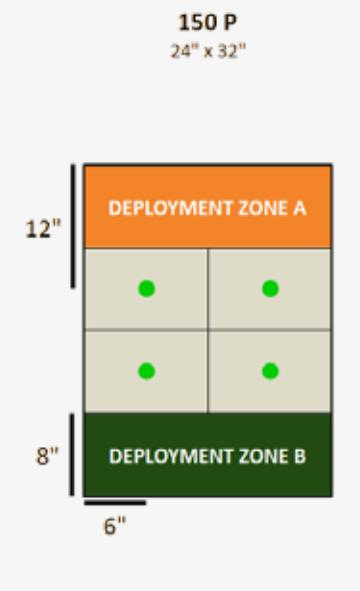

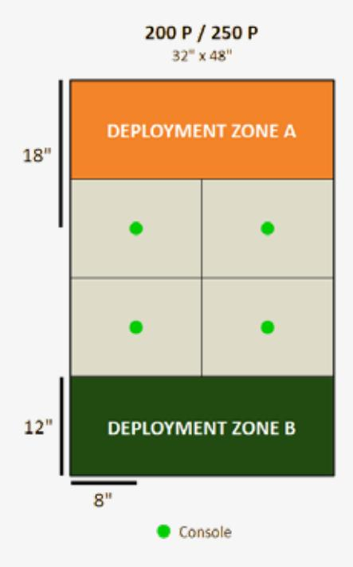

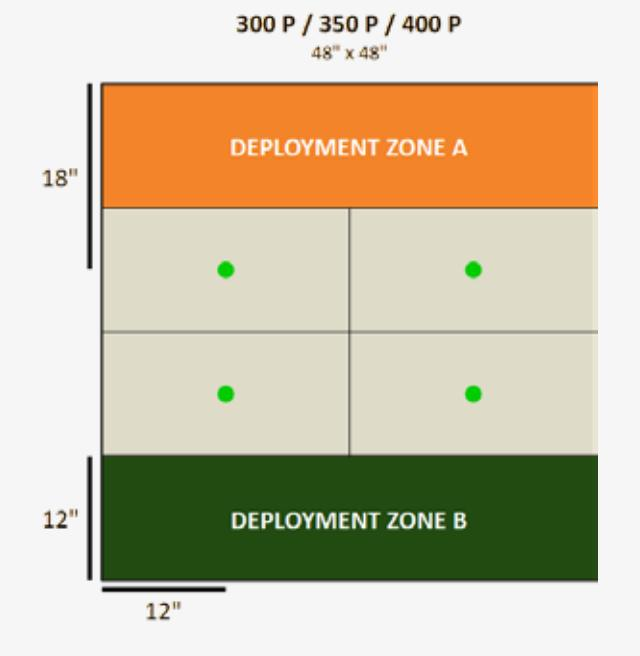

## SCENARIO SPECIAL RULES

#### QUADRANTS (ZO)

At the end of each Game Round, but not before, the table is divided into four Quadrants as seen on the map. Each player then checks how many Quadrants they are dominating and counts their Objective Points.

In this scenario each Quadrant is a Zone of Operations (ZO).

#### DOMINATE ZO

A Zone of Operations (ZO) is Dominated by a player if they have more Victory Points than the adversary inside the area. Only Troopers represented by Models or Markers (Camouflaged, Shasvastii-Embryo...) count, as well as Proxies and Peripheral Troops. Troops in a Null State do not count. Tokens representing weapons or pieces of equipment (like Mines or Deployable Repeaters), fake Holoechoes, and any Token that does not represent a Trooper does not count either.

A Trooper is inside a Zone of Operations when more than half the Trooper's base is inside that ZO.

#### SHASVASTII

Troopers possessing the Shasvastii Special Skill that are inside a Zone of Operations count while they are in the Unconscious State or any non-Null State.

#### BAGGAGE

Troopers possessing the Baggage piece of Equipment that are inside a Zone of Operations and in a non-Null State provide an additional 20 Victory Points for Dominating the ZO.

#### CONSOLES

There are 4 Consoles, placed on the center of each Quadrant (See map).

Each Console must be represented by a Console A Token or by a scenery piece of the same diameter (such as the Consoles of the ITS Objective Pack Alpha, the Human Consolesby Micro Art Studio, the Tech Consoles by Warsenal or the Comlink Console by Customeeple).

#### **HACK CONSOLES**

**SHORT SKILL** 

Attack, Scenario.

#### **REQUIREMENTS**

- ► Only Specialist Troops can declare this Skill.
- ► The Specialist Troop must be in Silhouette contact with a Console.

#### **EFFECTS**

- ► Allows the Specialist Troop to make a Normal WIP Roll to Hack the Console.
- ► If the roll is failed, this can be repeated as many times as necessary, each time spending the corresponding Short Skill and making the roll.
- ► A Hacked Console can be Hacked again by the other player applying the same procedure. In this case, both players will count that Console as Hacked.
- ► Player A and Player B Tokens can be used to mark the Hacked Consoles. It is recommended each player uses a different kind of Tokens.

#### SPECIALIST TROOPS

For the purposes of this scenario, only Hackers, Doctors, Engineers, Forward Observers, Paramedics, and Troopers possessing the Chain of Command or the Specialist Operative Special Skill are considered Specialist Troops.

Hackers, Doctors, and Engineers cannot make use of Repeaters or Peripheral (Servant) Models to perform tasks reserved for Specialist Troops.

#### OPERATIONAL LEARNING

When a Specialist Troop performs a **Skill with the Scenario Label** that requires a WIP Roll and **fails**, they benefit from the following MODs in subsequent Orders:

- ^ In the second consecutive Order, the Trooper applies a **+3 MOD to the WIP Roll** required for that Scenario Skill.
- ^ In the third consecutive Order—and subsequent Orders the Trooper applies **+3 and +1SD MODs to the WIP Roll**  required for that Scenario Skill.
- ^ These MODs are cumulative with any other MOD that applies to Skills with the Scenario Label.

#### IMPORTANT:

These MODs only apply to Rolls made in consecutive Orders by the same Trooper for the same Scenario Skill, with the same target, with no interruptions, or Orders spent on other Troopers:

- ^ If the Trooper passes the Roll, the sequence resets.
- ^ If the Trooper do not declare that Scenario Skill, the sequence resets.
- ^ If the Trooper declare the same Skill, but on a different target, the sequence resets.
- ^ If an Order is spent on any other Trooper, the sequence resets.
- ^ Only one sequence can be applied per Trooper and per Scenario-labelled Skill at a time.

#### KEY OPS

The Key Ops is a special tactics operator with unique training to conduct multi-domain reconnaissance and combat across the full spectrum of conflicts.

At the end of the Deployment Phase, in Initiative order, players must declare which Trooper from their Army List is their Key Ops. The Trooper chosen must be always one of the models deployed on the game table. Players are not allowed to choose Troopers in Hidden Deployment or in Marker state. This Trooper must always be on the game table as a Model and not as a Marker (Camouflaged, Holoecho…). Also, Irregular Troops and those whose Troop Type is REM or VH are not eligible to be Key Ops.

The Key Ops possesses the **Dodge (+3) and Tactical Awareness**  Special Skills, even if those are not listed on their Unit Profile. These Special Skills are not cumulative, if the Trooper already has them, then they are not applied.

The Key Ops is identified with a Player A or B Marker.

#### DOMINANT KEY OPS

Players who have their Key Ops in any non-Null State in a ZO Dominated by them, have a Dominant Key Ops.

#### HVT AND CLASSIFIED DECK NOT USED

In this scenario, the HVT Model and Secure HVT rules are not applied. Players will not deploy the HVT Model on the game table and they will not use the Classified Deck in this scenario.

## END OF THE MISSION

This scenario has a limited time frame, so it will automatically finish at the end of the **third Game Round.**

If one of the players starts their Active Turn in a Retreat! situation, the game will end at the end of that Turn.

#### **UPLINK CENTER**

TACTICAL SUPPORT OPTIONS 0 SUITABLE FOR REINFORCEMENTS Y

YES

#### MISSION OBJECTIVES

- At the end of the game, have an Activated Communication Antenna (2 Objective Points for each Activated Communication Antenna).
- At the end of the game, Control a Communication Antenna (1 Objective Point for each Controlled Communication Antenna).
- At the end of the game, Control the Tech-Coffin (3 Objective Points).
- At the end of the game, have an Active Lieutenant (1 Objective Point).

#### FORCES AND DEPLOYMENT

SIDE A and SIDE B: Both players will deploy on opposite sides of the game table, in Deployment Zones whose size depends on the number of Army Points in the Army Lists.

| SIDE    | ARMY POINTS | swc | GAME TABLE SIZE | DEPLOYMENT ZONES SIZES |
|---------|----------------|-----|--------------------|---------------------------|
| A and B | 150            | 3   | 24 in x 32 in      | 12 in x 24 in             |
| A and B | 200            | 4   | 32 in x 48 in      | 16 in x 32 in             |
| A and B | 250            | 5   | 32 in x 48 in      | 16 in x 32 in             |
| A and B | 300            | 6   | 48 in x 48 in      | 16 in x 48 in             |
| A and B | 350            | 7   | 48 in x 48 in      | 16 in x 48 in             |
| A and B | 400            | 8   | 48 in x 48 in      | 16 in x 48 in             |

It is not permitted to deploy in Silhouette contact with the TechCoffin or with the Communication Antennas.

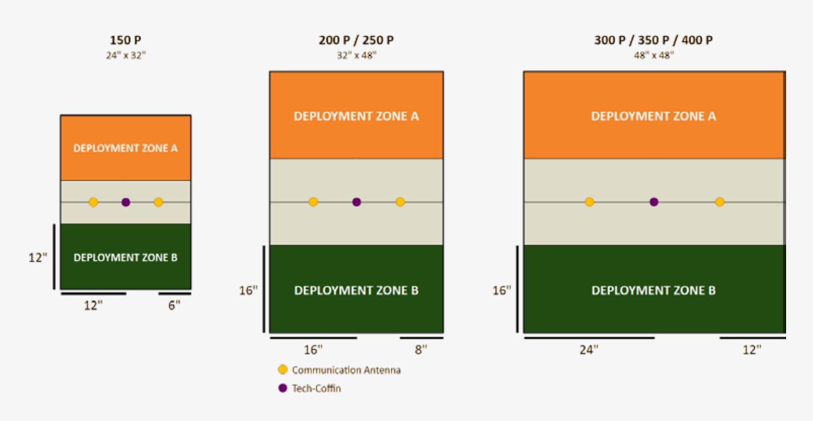

## SCENARIO SPECIAL RULES

#### COMMUNICATION ANTENNAS

There are 2 Communication Antennas on the central line of the table.

They are placed 12 inches from the table edges in 300/350/400 point games, 8 inches in 200/250 point games, and 4 inches in 150 point games. Each Communication Antenna must be represented by a Transmission Antenna Token (TRANS. ANTENNA) or with a scenery piece of the same diameter (such as the Antenna of the ITS Objective Pack Alpha, the Communications Array by Warsenal or the Sat Station Antenna by Customeeple).

#### **ACTIVATE COMMUNICATION ANTENNA SHORT SKILL**

Attack, Scenario

#### **REQUIREMENTS**

- ► Only Specialist Troops can declare this Skill.
- ► The Specialist Troop must be in Silhouette contact with a Communication Antenna.

#### **EFFECTS**

- ► Allows the Specialist Troop to make a Normal WIP Roll to Activate a Communication Antenna.
- ► If the roll is failed, this can be repeated as many times as necessary, each time spending the corresponding Short Skill and making the roll.
- ► An Activated Communication Antenna can be Activated again by the other player, applying the same procedure. In this situation, the Communication Antenna is no longer Activated by the adversary.
- ► Player A and Player B Tokens can be used to mark the Activated Communication Antenna. It is recommended each player uses a different kind of Tokens.

#### CONTROL A COMMUNICATION ANTENNA

A Communication Antenna is Controlled by a player as long as that player is the only one with at least one Trooper (as a Model, not a Marker) in Silhouette contact with it. So there cannot be any enemy Troopers in Silhouette contact with the Communication Antenna. Models in a Null State cannot do either.

#### TECH-COFFIN

There is 1 Tech-Coffin placed in the center of the table.

The Tech-Coffin must be represented by a Tech-Coffin Token or with a scenery piece of the same diameter (such as the Tech-Coffin of the ITS Objective Pack Alpha, the Stasis Coffins by Warsenal or the Cryo Pods by Customeeple).

#### CONTROL THE TECH-COFFIN

The Tech-Coffin is Controlled by a player as long as that player is the only one with at least one Trooper (as a Model, not a Marker) in Silhouette contact with it. So there cannot be any enemy Troopers in Silhouette contact with the Tech-Coffin. Models in a Null State cannot do either.

#### SPECIALIST TROOPS

For the purposes of this scenario, only Hackers, Doctors, Engineers, Forward Observers, Paramedics, and Troopers possessing the Chain of Command or the Specialist Operative Special Skill are considered Specialist Troops.

Hackers, Doctors, and Engineers cannot make use of Repeaters or Peripheral (Servant) Models to perform tasks reserved for Specialist Troops.

#### OPERATIONAL LEARNING

When a Specialist Troop performs a **Skill with the Scenario Label** that requires a WIP Roll and **fails**, they benefit from the following MODs in subsequent Orders:

In the second consecutive Order, the Trooper applies a **+3 MOD to the WIP Roll** required for that Scenario Skill.

In the third consecutive Order—and subsequent Orders—the Trooper applies **+3 and +1SD MODs to the WIP Roll** required for that Scenario Skill.

These MODs are cumulative with any other MOD that applies to Skills with the Scenario Label.

#### IMPORTANT:

These MODs only apply to Rolls made in consecutive Orders by the same Trooper for the same Scenario Skill, with the same target, with no interruptions, or Orders spent on other Troopers:

If the Trooper passes the Roll, the sequence resets.

If the Trooper do not declare that Scenario Skill, the sequence resets.

If the Trooper declares the same Skill, but with a different target, the sequence resets.

If an Order is spent on any other Trooper, the sequence resets.

Only one sequence can be applied per Trooper and per Scenario-Labelled Skill at a time.

#### ACTIVE LIEUTENANT

At the end of the game, a Lieutenant is Active if they are not in any Null state (Unconscious, Dead, Sepsitorized…), Isolated State, or any Immobilized State.

#### HVT AND CLASSIFIED DECK NOT USED

In this scenario, the HVT Model and Secure HVT rules are not applied. Players will not deploy the HVT Model on the game table and they will not use the Classified Deck in this scenario.

## END OF THE MISSION

This scenario has a limited time frame, so it will automatically finish at the end of the **third Game Round.**

If one of the players starts their Active Turn in a Retreat! situation, the game will end at the end of that Turn.

# RESILIENCE OPERATIONS

This tournament format is a new and different way to play games. It will test the resilience of the players and their capacity to overcome unexpected difficulties.

As Official Events, all Tournaments must comply with the Basic Rules of ITS; with the exception that they do not use the ITS scenarios nor the Classified Deck. Players must use the Tactical Objectives Deck and the Battle Conditions Deck.

## TACTICAL OBJECTIVES

The Tactical Objectives are objectives a player can accomplish to get Objective Points.

Each Tactical Objective provides up to 3 Objective Points, as listed in the special conditions of each objective.

Each Tactical Objective only provides its Objective Points once per game.

An Objective is accomplished when the player has got at least 1 Objective Point from it.

At the end of the game, having accomplished more Tactical Objectives than the adversary gives 1 extra Objective Point.

## BATTLE CONDITIONS

Battle Conditions are the particular circumstances in which the fight happens. They establish modifiers, bonuses or penalties throughout the game that will test the tactical and adaptive abilities of the players

## TACTICAL OBJECTIVES AND BATTLE CONDITIONS SELECTION

#### TACTICAL OBJECTIVES

Players have only one way of choosing the Tactical Objectives, with the Tactical Objectives Deck.

Players draw and select their Tactical Objectives after learning what faction their opponent will be playing with, but always before choosing one of the two Army Lists shown to the tournament organizer.

Each player must shuffle their own Tactical Objective Deck in front of their opponent, draw four cards, and discard one of them.

Tactical Objectives only apply to the player who drew and selected them, and are Private Information until the end of the game unless otherwise specified.

Once the Tactical Objectives have been drawn and selected, players can spend one Command Token to discard one of their Tactical Objectives and draw a new one.

After the Deployment Phase and before the first Game Round, both players must choose one of their Tactical Objectives and reveal it at the same time. If "Priority Target" has been selected among the Tactical Objectives, this card must be revealed first.

Before beginning the next Game Round, both players must reveal another Tactical Objective simultaneously.

The player must keep their Tactical Objective cards and show them to their opponent at the end of the game.

#### BATTLE CONDITIONS

Players have only one way of choosing the Battle Conditions, with the Battle Conditions Deck.

Each Player draw and select their Battle Conditions after the Initiative Roll, but always before the Deployment Phase.

Each player must shuffle their own Battle Conditions Deck in front of their opponent, draw two cards, and discard one of them. In Initiative order, players show their cards and perform the necessary decisions or placement of elements specified on the Battle Conditions card.

If both players have the same Battle Condition, the player that has the second Player Turn must discard their card, draw a new one from the Battle Conditions Deck, and apply the new card.

Battle Conditions last for the whole game and affect both players.

If there is more than one Movement Bonus granted by a Battle Condition, only one of them will apply.

# DEPLOYMENT AND END OF MISSION

This Extra uses the standard Deployment and End of Mission of the ITS scenarios.

#### FORCES AND DEPLOYMENT

SIDE A and SIDE B: Both players will deploy on opposite sides of the game table, in Deployment Zones whose size depends on the number of Army Points in the Army Lists.

| ARMY POINTS | swc                             | GAME TABLE SIZE                            | DEPLOYMENT ZONES SIZES                                                                                                                                                                                                                                             |
|----------------|---------------------------------|-----------------------------------------------|-----------------------------------------------------------------------------------------------------------------------------------------------------------------------------------------------------------------------------------------------------------------------|
| 150            | 3                               | 24 in x 32 in                                 | 8 in x 24 in                                                                                                                                                                                                                                                          |
| 200            | 4                               | 32 in x 48 in                                 | 12 in x 32 in                                                                                                                                                                                                                                                         |
| 250            | 5                               | 32 in x 48 in                                 | 12 in x 32 in                                                                                                                                                                                                                                                         |
| 300            | 6                               | 48 in x 48 in                                 | 12 in x 48 in                                                                                                                                                                                                                                                         |
| 350            | 7                               | 48 in x 48 in                                 | 12 in x 48 in                                                                                                                                                                                                                                                         |
| 400            | 8                               | 48 in x 48 in                                 | 12 in x 48 in                                                                                                                                                                                                                                                         |
|                | POINTS  150  200  250  300  350 | POINTS SWC  150 3  200 4  250 5  300 6  350 7 | POINTS         SWC         SIZE           150         3         24 in x 32 in           200         4         32 in x 48 in           250         5         32 in x 48 in           300         6         48 in x 48 in           350         7         48 in x 48 in |

#### END OF THE MISSION

This scenario has a limited time frame, so it will automatically finish at the end of the **third Game Round**.

If one of the players starts their Active Turn in a Retreat! situation, the game will end at the end of that Turn.

#### TACTICAL ELEMENTS

Tactical Elements are those pieces of Equipment, weaponry, individuals, systems, etc. that the Troopers have to interact in a scenario. They are listed below.

In a Resilience Operations game, players deploy all the Tactical Elements except the F-13 Defensive Turrets, which are placed on the game table only if a Battle Condition card specifies it.

#### **BEACONS**

Before the Deployment Phase, each player must place **two Beacons** totally inside their Deployment Zone, in Silhouette contact with any point of its edge, as shown on the map.

The player that kept Deployment places their Beacons first.

A Beacon can only be damaged with Weapons possessing the Anti-materiel Trait.

If a Beacon's Structure Attribute is reduced to 0 or below, it is Destroyed and removed from the game table.

The Beacons can be targeted by the Engineer Special Skill or the GizmoKit piece of Equipment.

It is not allowed to deploy in Silhouette contact with a Beacon.

The Beacons must be represented by a Beacon Token (BEACON) or by a scenery piece of the same diameter (such as the Beacon of the ITS Objectives Pack Alpha, the Tactical Beacons by Micro Art Studio, the Tracking Beacons by Warsenal or the Mark One Beacons by Customeeple).

#### REALUU

| ARM | BTS | STR | S |
|-----|-----|-----|---|
| 4   | 4   | 3   | 2 |

GizmoKit (PH=10)

300 P / 350 P / 400 P

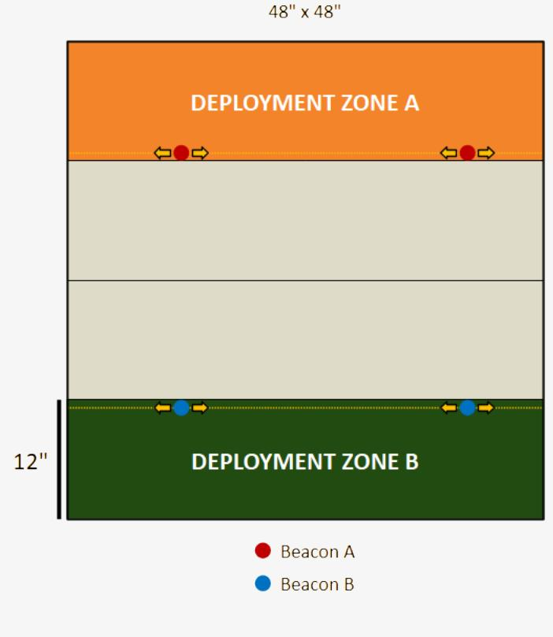

**EXAMPLE OF BEACONS PLACEMENT** 

#### HVTS

The HVTs follow the Civilian Rules that can be found in the ITS document. The sole exception is how the HVTs are placed on the game table.

Before the Deployment Phase, each player must place four HVTs totally inside the area extending four inches from their Deployment Zone.

The player that kept Deployment places their HVTs first.

It is not allowed to deploy in Silhouette contact with an HVT.

#### HVT

ISC: HVT (High Value Target)

| MOV                                             | CC | BS | PH | WIP | ARM | BTS | VITA | S |
|-------------------------------------------------|----|----|----|-----|-----|-----|------|---|
|                                                 | 6  | 5  | 10 | 11  |     |     |      | 2 |
| CIVILIAN BS Weapon: ; CC Weapon: ; SWC: ; Cost: |    |    |    |     |     |     |      |   |

In some scenarios, the enemy HVTs are reactive and hostile, reacting as if they are an enemy Trooper. In these scenarios, players are allowed to perform Attacks against them and will use the Hostile HVT Trooper Profile:

#### HOSTILE HVT

ISC: Hostile HVT

| MOV                                                                   | CC | BS | PH | WIP | ARM | BTS | VITA | S |
|-----------------------------------------------------------------------|----|----|----|-----|-----|-----|------|---|
| 4-4                                                                   | 6  | 8  | 11 | 11  | 1   | 0   | 1    | 2 |
| Hostile Civilian BS Weapon: Stun Pistol; CC Weapon: ; SWC: ; Cost: |    |    |    |     |     |     |      |   |

#### BEEPERS

Each Trooper possesses **a Beeper**. If the Trooper is a Specialist Trooper, then they will have an extra Beeper.

To place a Beeper, the Trooper must declare the Place Deployable Skill.

Beepers cannot be placed as part of a Coordinated Order.

Beepers can be damaged by Attacks.

If a Beeper's Structure Attribute is reduced to 0 or below, it is Destroyed and removed from the game table.

The Beepers must be represented by Player A or Player B Tokens or by Models or pieces of scenery with the same Silhouette value.

#### BEEPER

| ARM | BTS | STR | S |
|-----|-----|-----|---|
| 2   | 0   | 1   | 2 |

#### OBJECTIVES

Before the Deployment Phase, each player must place **three Objectives** totally inside the area extending eight inches from the central line to his/her half of the game table.

The player that kept Deployment places their Objectives first.

It is not allowed to deploy in Silhouette contact with an Objective.

Each Objective must be represented by an Objective Token (OBJECTIVE) or by a scenery piece of the same diameter (such as the Objective of the ITS Objectives Pack or the Alpha Info Hubs by Micro Art Studio).

#### F-13 DEFENSIVE TURRET

The F-13 Defensive Turrets are Deployable Weapons, reacting with BS Attack or CC Attack to any Order declared by an active Enemy Model (but not Markers) in LOF or in Silhouette contact.

When the STR Attribute value of an F-13 Defensive Turret is 0 or less, it is removed from the game table.

The F-13 Defensive Turrets must be represented by a Defensive Turret A /B Token or by a Model or piece of scenery with the same Silhouette value (for example Turrets from the ITS Objectives Pack Alpha).

#### F-13 DEFENSIVE TURRET

ISC: TURRET F-13

| MOV | CC | BS | PH | WIP | ARM | BTS | STR | S |
|-----|----|----|----|-----|-----|-----|-----|---|
|     | 5  | 10 |    |     | 2   | 3   | 1   | 2 |

Equipment: 360º Visor Special Skills: Total Reaction BS Weapons: Combi Rifle Melée Weapons: PARA (-3) CCW

# GLOSSARY

#### CAPTURE

Some Tactical Objectives require Troopers to Capture Tactical Elements. The Capture Special Skill allows Troopers to Capture and then carry a Tactical Element.

#### **CAPTURE TACTICAL ELEMENT**

**SHORT SKILL**

Attack

#### **REQUIREMENTS**

The Trooper must be in one of the following situations:

- ► Be in Silhouette contact with a Model in a Null State who has a Tactical Element.
- ► Be in Silhouette contact with an allied Trooper with a Tactical Element.
- ► Be in Silhouette contact with an unaccompanied Tactical Element.

#### **EFFECTS**

- ► Without the need for a Roll, the Trooper Captures the Tactical Element.
- ► Troopers must follow the Common Rules of Captured Tactical Elements.

#### COMMON RULES OF CAPTURED TACTICAL ELEMENTS

- ^ Each Model can carry a maximum of 1 Captured Tactical Element.
- ^ As an exception, Troopers possessing the Baggage Special Skill can carry up to 2 Captured Tactical Elements.
- ^ Only Models, and not Markers (Camo, Impersonation, Holoechoes…), can carry Captured Tactical Elements.
- ^ Captured Tactical Element must always be kept on the table.
- ^ The Captured Tactical Element always remains in Silhouette contact with the Trooper which is carrying it.
- ^ If the Trooper carrying the Tactical Element enters or is in any Null State, they drop the Tactical Element. Move the Tactical Element slightly out of Silhouette contact with the Trooper
- ^ Tactical Elements don't block movement or LoF.

#### CONTROL

A Tactical Element is Controlled by a player as long as that player is **the only one with at least one Trooper** (as a Model, not a Marker) **in Silhouette contact** with it. So there cannot be any enemy Troopers in Silhouette contact with the Tactical Element. Models in a Null State cannot do either.

#### DOMINATE

A Quadrant or Sector is Dominated by a player if **they have more Victory Points than the adversary** inside the area.

A Trooper is inside when more than half the Trooper's base is inside that area.

Only Troopers represented by Models or Markers (Camouflaged, Shasvastii-Embryo, Seed-Embryo…) count, as well as Proxies and Peripheral Troopers. Troopers in a Null State do not count. Tokens representing weapons or pieces of equipment (like Mines or Deployable Repeaters), fake Holoechoes, and any Token that does not represent a Trooper does not count either.

Troopers possessing the **Baggage** piece of Equipment that are inside a Quadrant or Sector and in a non-Null State provide an additional 20 Victory Points for Dominating that area.

#### KILLING

Troopers are considered Killed by the adversary when they enter Dead State, or they are in a Null State at the end of the game.

Troopers that **have not been deployed on the game table**, as a Model or Marker, at the end of the game will be considered to be Killed by the adversary.

#### SUBJUGATE

A Quadrant or Sector is Subjugated by a player as long as that player is **the only one with at least one Trooper** (as a Model, not a Marker) **inside the area.** So there cannot be any enemy Troopers inside the Quadrant or Sector. Models in a Null State cannot do either.

A Trooper is inside a Quadrant or Sector when more than half the Trooper's base is inside that area.

## SUMMARY OF RESILIENCE OPERATION SEQUENCE

- 1. Selection of Tactical Objectives.
  - 1.1. Draw 4 and discard 1.
  - 1.2. By spending a Command Token, you can discard one of your Tactical Objectives and draw a new one.
- 2. Army List Selection.
- 3. Initiative Roll.
- 4. Battle Conditions Selection.
  - 4.1. Draw 2 and discard 1.
  - 4.2. Place elements specified in the Battle Conditions.
- 5. Place Tactical Elements.
- 6. Deployment Phase.
- 7. Reveal a Tactical Objective (Priority Target first if selected).
- 8. Start turn.

